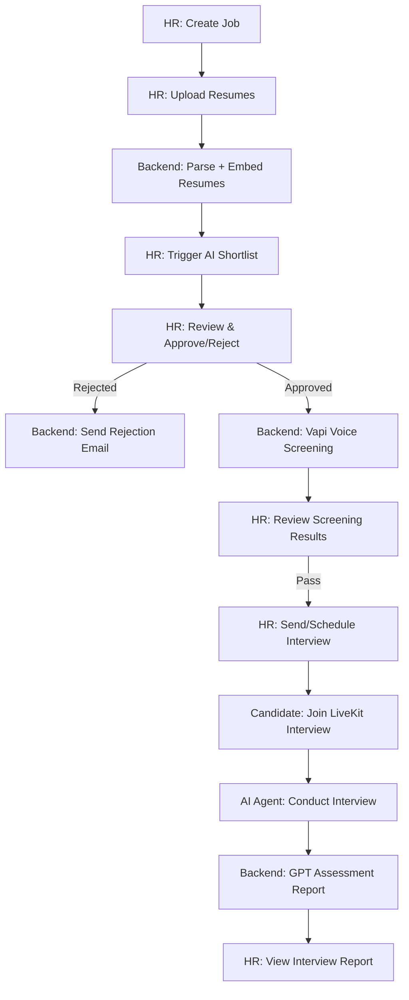

# AI Recruitment POC — Features & Application Flow

A full-stack AI recruitment pipeline that automates hiring from job creation through resume screening, voice screening, AI interviews, and assessment reports. This document catalogs all features and explains how the entire application works.

---

## Table of Contents

1. [Overview](#overview)
2. [Architecture](#architecture)
3. [Applications](#applications)
4. [Complete Feature List](#complete-feature-list)
5. [End-to-End Application Flow](#end-to-end-application-flow)
6. [Data Models](#data-models)
7. [API Endpoints](#api-endpoints)
8. [Background Jobs](#background-jobs)
9. [AI & External Integrations](#ai--external-integrations)
10. [Frontend Routes](#frontend-routes)
11. [Security & Access Model](#security--access-model)
12. [Infrastructure & Local Development](#infrastructure--local-development)

---

## Overview

The **AI Recruitment Screening & Interview POC** is a proof-of-concept platform that automates the recruitment pipeline:

| Stage | What Happens |
|-------|--------------|
| **Job Setup** | HR creates jobs manually or by uploading a JD (PDF/DOCX) for AI parsing |
| **Resume Ingestion** | Candidates upload resumes (PDF/DOCX/ZIP); AI parses them into structured profiles |
| **AI Shortlisting** | GPT-4o scores candidates against the job description |
| **HR Review** | HR approves, rejects, or overrides AI shortlist recommendations |
| **Voice Screening** | Vapi.ai places outbound calls to approved candidates; GPT extracts structured answers |
| **AI Interview** | Candidates join a LiveKit room for a real-time voice interview with an AI agent |
| **Assessment** | GPT-4o generates a structured interview report with scores and recommendations |

Two separate frontend applications serve different users:

- **HR App** (`hr-app/`) — Recruiter dashboard and pipeline management (port 5173)
- **Candidate App** (`candidate-app/`) — Token-based interview experience (port 5174)

---

## Architecture

```
┌─────────────────────────────────────────────────────────────────────────────┐
│                              FRONTEND LAYER                                  │
│  ┌──────────────────────┐              ┌──────────────────────┐               │
│  │      HR App          │              │   Candidate App      │               │
│  │  React + Vite + TS   │              │  React + LiveKit     │               │
│  │  Port 5173           │              │  Port 5174           │               │
│  └──────────┬───────────┘              └──────────┬───────────┘               │
└─────────────┼──────────────────────────────────────┼──────────────────────────┘
              │ REST API                             │ REST + WebSocket
              ▼                                      ▼
┌─────────────────────────────────────────────────────────────────────────────┐
│                           BACKEND (FastAPI)                                  │
│  ┌─────────┐ ┌────────────┐ ┌───────────┐ ┌───────────┐ ┌──────────────┐  │
│  │  Jobs   │ │ Candidates │ │ Shortlist │ │ Screening │ │  Interviews  │  │
│  │  API    │ │    API     │ │    API    │ │    API    │ │     API      │  │
│  └────┬────┘ └─────┬──────┘ └─────┬─────┘ └─────┬─────┘ └──────┬───────┘  │
│       └────────────┴──────────────┴─────────────┴──────────────┘          │
│                              Services Layer                                  │
│  Port 8000  │  SQLAlchemy (async)  │  File uploads (local filesystem)       │
└─────────────┼──────────────────────┼────────────────────────────────────────┘
              │                      │
              ▼                      ▼
┌─────────────────────────┐  ┌──────────────────────────────────────────────┐
│  PostgreSQL 15          │  │  Celery Worker + Beat                         │
│  Port 5433              │  │  Redis (broker + locks)                       │
│                         │  │  Port 6379                                    │
└─────────────────────────┘  └──────────────────────────────────────────────┘
              │
              ▼
┌─────────────────────────────────────────────────────────────────────────────┐
│                        EXTERNAL SERVICES                                     │
│  OpenAI (GPT-4o, STT/TTS)              │  Vapi.ai (outbound voice calls)   │
│  LiveKit Cloud (rooms, egress)         │  Gmail API (interview/rejection)  │
│  Interview Agent (separate process)    │  Deepgram (Vapi STT)              │
└─────────────────────────────────────────────────────────────────────────────┘
```

### Tech Stack

| Layer | Technology |
|-------|-----------|
| **HR Frontend** | React 18, TypeScript, Vite, Tailwind CSS, Radix UI, TanStack Query, Axios, jsPDF |
| **Candidate Frontend** | React 18, TypeScript, Vite, Tailwind CSS, LiveKit Components |
| **Backend API** | Python 3.11+, FastAPI, Pydantic, SQLAlchemy (async), Alembic |
| **Task Queue** | Celery + Redis |
| **Database** | PostgreSQL 15 |
| **AI** | OpenAI GPT-4o, Whisper, TTS |
| **Voice Screening** | Vapi.ai + Deepgram STT |
| **AI Interview** | LiveKit Agents + OpenAI |
| **Email** | Gmail OAuth (interview invitations, rejection emails) |
| **Document Parsing** | PyMuPDF (PDF), python-docx (DOCX) |
| **E2E Tests** | Playwright (HR app) |

---

## Applications

### HR App (`hr-app/`)

The recruiter-facing web application. No login required (POC is intentionally open).

**Key capabilities:**
- Dashboard with cross-job metrics and activity feed
- Job creation with JD upload and AI parsing
- Multi-tab resume pipeline (Upload → Parsing → Parsed → Shortlisting → Shortlisted)
- AI shortlist review with HR approve/reject/override and feedback
- Voice screening management with call window configuration
- Interview pipeline (Pending → Scheduled → Ongoing → Completed)
- Interview and shortlist report viewing with PDF export
- System settings (phone regions, retry policy)

### Candidate App (`candidate-app/`)

The candidate-facing interview experience. Access is via a unique UUID token in the URL — no account or login.

**Key capabilities:**
- Interview landing page with session validation
- Browser microphone/camera permission check
- LiveKit-powered AI voice interview room
- Rejoin, expired, and error state handling
- Interview completion thank-you page

### Interview Agent (`backend/interview_agent.py`)

A standalone LiveKit agent process (not Celery) that runs alongside the backend:

- Joins LiveKit rooms when candidates start interviews
- Conducts adaptive voice interviews using job rubric questions
- Asks follow-up questions based on answer depth
- Saves transcript and triggers assessment report generation

### Prototype Apps (`prototype/`)

Legacy UI explorations with mock/stub data. Not connected to the live backend. Superseded by production `hr-app/` and `candidate-app/`.

---

## Complete Feature List

### 1. Job Management

| Feature | Description | Location |
|---------|-------------|----------|
| Create job manually | Title, description, skills, experience range, screening questions, interview rubric | HR: `CreateJobForm.tsx` / API: `POST /api/jobs` |
| Parse job description (JD) | Upload PDF/DOCX → GPT-4o extracts fields and generates questions | HR: `CreateJobForm.tsx` / API: `POST /api/jobs/parse-jd` |
| Default screening questions | Auto-applied if none provided (availability, CTC, notice period, etc.) | `screening_defaults.py` |
| Interview rubric enrichment | GPT generates hidden `expected_points` for each interview question | `expected_answer_service.py` |
| List jobs | Filter by status; Jobs page cards + dashboard | API: `GET /api/jobs` / `JobsPage.tsx` |
| View job details | Title, skills, status, screening/interview config | `JobHeader.tsx` |
| Edit job | Update metadata, questions, call window, timezone | `EditJobModal.tsx` / API: `PATCH /api/jobs/{id}` |
| Delete job | Cascades candidates, shortlist, screening, interviews | `JobHeader.tsx` / API: `DELETE /api/jobs/{id}` |
| Job phase navigation | Jobs page card buttons + hamburger pipeline panel | `JobsPage.tsx` / `JobPhaseNav.tsx` |

### 2. Resume Upload & Parsing

| Feature | Description | Location |
|---------|-------------|----------|
| Upload resumes | Drag-and-drop PDF, DOCX, or ZIP of resumes | `UploadTab.tsx` / API: `POST /api/jobs/{id}/resumes` |
| ZIP extraction | Safe extraction with zip-slip protection and size limits | `zip_extract_service.py` |
| Duplicate detection | Skips files with same `original_filename` per job | `candidates.py` route |
| Parse queue | Concurrency-limited parsing (`MAX_CONCURRENT_PARSES`) | `parse_queue_service.py` |
| Text extraction | PDF via PyMuPDF, DOCX via python-docx | `document_extractor.py` |
| AI resume parsing | GPT-4o structured extraction (name, email, phone, skills, experience, education) | `resume_parser.py` |
| Parse status tracking | `pending_parse` → `parse_queued` → `parsing` → `ready` (or `parse_failed`) | `Candidate` model |
| Retry failed parse | Re-queue parsing for failed candidates | `UploadTab.tsx` / API: `POST .../retry-parse` |
| Parsing progress UI | Live tab showing candidates in parse queue | `ParsingTab.tsx` |
| Browse parsed resumes | Search, multi-select, send to shortlisting | `ParsedResumesTab.tsx` |
| Candidate detail modal | View parsed profile, edit phone, download resume | `CandidateDetailModal.tsx` |
| Delete candidate | Remove candidate and cascade related records | Multiple tabs / API: `DELETE /api/candidates/{id}` |

### 3. AI Shortlisting

| Feature | Description | Location |
|---------|-------------|----------|
| Trigger AI shortlist | Batch score all `ready` candidates without existing results | `ParsedResumesTab.tsx` / API: `POST /api/jobs/{id}/shortlist` |
| Concurrency lock | Redis lock prevents duplicate shortlist runs (409 if in progress) | `shortlist.py` route |
| GPT scoring | Match score, recommendation, strengths, gaps per candidate | `shortlist_service.py` |
| Shortlist progress polling | Progress bar and status during batch run | `AIShortlistingTab.tsx` |
| Review shortlist results | Table with scores, filters, skill match matrix | `ShortlistTab.tsx`, `SkillMatchMatrix.tsx` |
| HR approve/reject/override | Set decision on each shortlist result | `ShortlistTab.tsx` / API: `PATCH /api/shortlist/{id}/decision` |
| HR feedback on AI | Submit feedback type and comments | `ShortlistTab.tsx` / API: `POST /api/shortlist/{id}/feedback` |
| Bulk HR actions | Approve/reject multiple candidates at once | `ShortlistTab.tsx` |
| Shortlist report (modal/page) | Detailed AI analysis per candidate | `ShortlistReportModal.tsx`, `ShortlistReportPage.tsx` |
| Export shortlist CSV/PDF | Client-side export from shortlist data | `shortlistReportExport.ts`, `shortlistReportPdf.ts` |
| Preserve HR decisions on re-run | Re-triggering shortlist updates AI scores but keeps HR decisions | `shortlist_service.py` |

### 4. Voice Screening (Vapi)

| Feature | Description | Location |
|---------|-------------|----------|
| Configure screening questions | Edit per-job screening criteria | `ScreeningCriteriaModal.tsx` |
| Call window settings | Set allowed calling hours and timezone per job | `ScreeningSettingsCard.tsx` |
| Trigger screening calls | Start outbound Vapi calls for approved candidates | `ScreeningTab.tsx` / API: `POST /api/jobs/{id}/screening/trigger` |
| Auto-screen on approve | Automatically queue screening when HR approves shortlist (if Celery up + in call window) | `shortlist.py` route |
| Phone validation | E.164 normalization; India (+91) geography enforcement | `phone_validation.py` |
| Outbound Vapi call | GPT-4o assistant + Deepgram STT + voice synthesis | `vapi_service.py` |
| Webhook processing | Vapi callbacks update call status and transcript | API: `POST /api/screening/webhook` |
| GPT field extraction | Extract CTC, notice period, availability, willingness from transcript | `screening_tasks.py` |
| Call outcome classification | no_answer, voicemail, dropped, completed, etc. | `screening_tasks.py` |
| Auto-retry failed calls | Configurable max retries with delays (no-answer/voicemail) | `SystemSettings`, Celery Beat |
| Poll active calls | Refresh in-flight call status from Vapi | `ScreeningTab.tsx` / API: `POST /api/screening/{id}/refresh` |
| HR screening decision | Pass / fail / needs_review on completed calls | `ScreeningCallDetails.tsx` |
| Screening report PDF | Client-side PDF from call data and transcript | `screeningReportPdf.ts` |
| Queue for interview | Mark passed candidate for interview pipeline | `ScreeningCallDetails.tsx` |
| Schedule interview from screening | Open schedule modal directly from screening | `ScheduleInterviewModal.tsx` |
| Screening tabs | Pending / Completed / Flagged candidate views | `ScreeningTab.tsx` |

### 5. AI Interview Pipeline

| Feature | Description | Location |
|---------|-------------|----------|
| Interview pipeline view | Tabs: Pending, Scheduled, Ongoing, Completed | `InterviewsTab.tsx` |
| Queue candidate | Mark screening-passed candidate for interview (no email) | API: `POST /api/candidates/{id}/interview/queue` |
| Send interview link | Create session + email invitation with 7-day expiry | `InterviewsTab.tsx` / API: `POST .../interview/send` |
| Schedule interview | Create session with specific datetime + scheduled email | `ScheduleInterviewModal.tsx` / API: `POST .../interview/schedule` |
| Edit interview rubric | Update interview questions on existing job | `InterviewRubricPanel.tsx` |
| Copy interview link | Copy candidate URL to clipboard | `InterviewsTab.tsx` |
| Candidate landing page | Validate token, show job/candidate info, mic permission | `InterviewLandingPage.tsx` |
| Start interview session | Create LiveKit room, dispatch agent, return JWT | API: `POST /api/interview/{token}/start` |
| LiveKit interview room | Real-time voice conversation with AI agent | `InterviewRoomPage.tsx` |
| Adaptive follow-ups | Agent asks depth-probing follow-ups on thin answers | `interview_agent.py` |
| Technical/oral question constraints | Voice-only, technical-only validation rules | `interview_question_constraints.py` |
| End interview | Mark session complete; agent saves transcript | API: `POST /api/interview/{token}/complete` |
| Room recording (egress) | LiveKit egress for interview recording | `livekit_service.py` |
| Rejoin in-progress interview | Return to active room if session not expired | `InterviewLandingPage.tsx` |
| Expired/invalid token handling | Friendly error states for bad or expired tokens | `InterviewLandingPage.tsx` |
| Interview complete page | Thank-you screen after interview ends | `InterviewCompletePage.tsx` |

### 6. Assessment & Reports

| Feature | Description | Location |
|---------|-------------|----------|
| GPT interview assessment | Scorecard or rubric-mode assessment from transcript | `assessment_service.py` |
| Rubric point coverage | Score against `expected_points` per interview question | `assessment_service.py`, `report_refresh_service.py` |
| Dual assessment trigger | Agent enqueues report on save; LiveKit `room_finished` webhook as fallback | `interview_agent.py`, `interviews.py` |
| View interview report | Scores, recommendation, strengths, weaknesses, rubric Q&A | `ReportPage.tsx` |
| Transcript viewer | Chat-style transcript display | `TranscriptChat.tsx` |
| Interview report PDF | Client-side PDF generation | `interviewReportPdf.ts` |
| Report polling | Auto-refresh until assessment completes | `ReportPage.tsx` |
| Candidate journey timeline | Full pipeline history for a candidate | `CandidateTimeline.tsx` |

### 7. Dashboard & Settings

| Feature | Description | Location |
|---------|-------------|----------|
| Dashboard KPIs | Active jobs, total candidates, screened, interviewed counts | `DashboardPage.tsx` |
| Per-job stats table | Links to each job phase | `DashboardPage.tsx` |
| Recent screening activity | Feed of latest screening events | `DashboardPage.tsx` |
| System settings | Phone region allowlist, geography enforcement | `SettingsPage.tsx` |
| Screening retry config | Max retries, delay between retries | `SettingsPage.tsx` |
| Error boundary | Graceful UI error handling | `ErrorBoundary.tsx` |
| Backend error retry | User-friendly API failure UI | `BackendError.tsx` |
| Toast notifications | Success/error feedback | `react-hot-toast` |

### 8. Developer & Quality

| Feature | Description | Location |
|---------|-------------|----------|
| API documentation | Auto-generated OpenAPI/Swagger docs | `http://localhost:8000/docs` |
| Health check | `GET /health` | `main.py` |
| E2E tests | Playwright tests for HR app flows | `hr-app/e2e/` |
| Dev startup script | One-command local environment launch | `start-dev.ps1` |
| Gmail OAuth setup | One-time script for email credentials | `backend/scripts/gmail_auth.py` |

---

## End-to-End Application Flow

### High-Level Pipeline



### Detailed Step-by-Step Flow

#### Phase 1: Job Creation

1. HR navigates to `/jobs/new` in the HR App.
2. Optionally uploads a JD file (PDF/DOCX) → `POST /api/jobs/parse-jd` → GPT-4o extracts title, description, skills, experience range, and generates screening + interview questions.
3. HR reviews/edits the form, configures screening questions and interview rubric.
4. `POST /api/jobs` creates the job record.
5. Backend applies default screening questions if none provided.
6. Backend enriches interview questions with GPT-generated `expected_points` for rubric scoring.
7. HR is redirected to `/jobs/{jobId}` (AI Shortlist phase).

#### Phase 2: Resume Ingestion

1. HR uploads resumes on the **Upload** tab (PDF, DOCX, or ZIP).
2. `POST /api/jobs/{jobId}/resumes` saves files to local storage and creates `Candidate` records.
3. Duplicate filenames are skipped per job.
4. Parse queue (`parse_queue_service`) limits concurrent parses.
5. **Celery pipeline** runs for each resume:
   - `extract_resume_text` — extract text from PDF/DOCX
   - `parse_resume` — GPT-4o structured parsing → `parsed_data` JSON; status → `ready`
6. Candidate `parse_status` progresses: `pending_parse` → `parse_queued` → `parsing` → `ready`.
7. HR monitors progress on **Parsing** and **Parsed Resumes** tabs (polled every few seconds).

#### Phase 3: AI Shortlisting

1. HR selects candidates on **Parsed Resumes** tab and triggers shortlisting.
2. `POST /api/jobs/{jobId}/shortlist` sets a Redis lock and enqueues `run_shortlist` Celery task.
3. For each `ready` candidate without an existing `ShortlistResult`:
   - GPT-4o scores match, generates recommendation, strengths, and gaps.
   - Upsert `ShortlistResult` (preserves existing HR decisions on re-run).
4. HR monitors **AI Shortlisting** tab (polls `GET /api/jobs/{id}/shortlist/status`).
5. Results appear on **AI Shortlisted** tab with scores and skill match matrix.

#### Phase 4: HR Shortlist Review

1. HR reviews each candidate's AI shortlist report.
2. Actions: **Approve**, **Reject**, or **Override** → `PATCH /api/shortlist/{id}/decision`.
3. Optional feedback → `POST /api/shortlist/{id}/feedback`.
4. On **reject**: backend sends rejection email via Gmail.
5. On **approve**: if Celery is healthy and within call window, auto-triggers voice screening.

#### Phase 5: Voice Screening

1. HR navigates to `/jobs/{jobId}/screening`.
2. Configures call window (from/to time, timezone) and screening questions.
3. Clicks **Start Calling** → `POST /api/jobs/{jobId}/screening/trigger`.
4. For each approved candidate with valid phone:
   - `ScreeningCall` record created with `pending` status.
   - Celery task `initiate_screening_call` places Vapi outbound call.
5. Vapi conducts AI voice conversation using job screening questions.
6. On call end, Vapi webhook → `POST /api/screening/webhook`:
   - GPT-4o extracts structured fields (CTC, notice period, availability, etc.).
   - Call outcome classified (completed, no_answer, voicemail, dropped).
7. Failed outcomes auto-retry per system settings (Celery Beat dispatches every 60s).
8. HR reviews completed calls, sets **pass** / **fail** / **needs_review**.
9. Passed candidates can be queued or scheduled for interview.

#### Phase 6: Interview Scheduling & Delivery

1. HR navigates to `/jobs/{jobId}/interviews`.
2. Pipeline tabs show candidates by status:
   - **Pending** — queued but no session yet
   - **Scheduled** — session with future datetime
   - **Ongoing** — active interview in progress
   - **Completed** — finished interviews
3. HR actions:
   - **Send link** → creates `InterviewSession` with UUID token + emails candidate
   - **Schedule** → creates session with specific datetime + deferred email
4. Candidate receives email with link: `http://localhost:5174/interview/{token}`.

#### Phase 7: Candidate Interview

1. Candidate opens interview link → `InterviewLandingPage`.
2. `GET /api/interview/{token}` validates session (not expired, not completed).
3. Candidate grants microphone permission.
4. Clicks **Start Interview** → `POST /api/interview/{token}/start`:
   - Creates LiveKit room.
   - Dispatches AI interview agent.
   - Returns LiveKit JWT and room URL.
5. Candidate joins `InterviewRoomPage` (LiveKit WebRTC).
6. **Interview Agent** (`interview_agent.py`):
   - Loads job rubric and candidate context.
   - Greets candidate and asks interview questions.
   - Adapts with follow-ups on thin answers (max 2 per topic).
   - Saves transcript on completion.
   - Enqueues `generate_interview_report` Celery task.
7. Candidate ends interview → `POST /api/interview/{token}/complete`.
8. Redirected to thank-you page.

#### Phase 8: Assessment & Report

1. Celery task `generate_interview_report` runs GPT-4o assessment:
   - **Scorecard mode** — overall + dimension scores if no rubric questions.
   - **Rubric mode** — per-question scoring against `expected_points`.
2. Creates `InterviewReport` linked to `InterviewSession`.
3. HR navigates to `/jobs/{jobId}/candidates/{candidateId}/report`.
4. `GET /api/candidates/{id}/report` returns full report (polls until ready).
5. HR views scores, recommendation, transcript, rubric Q&A.
6. Can export report as PDF.

---

## Data Models

| Model | Table | Key Fields | Purpose |
|-------|-------|------------|---------|
| **Job** | `jobs` | tenant_id, title, description, required_skills, experience_min/max, screening_questions (JSON), interview_questions (JSON), screening_call_from/to, screening_timezone, status | Job posting and configuration (tenant-scoped) |
| **Candidate** | `candidates` | job_id, name, email, phone, resume_path, parsed_data (JSON), parse_status, original_filename | Resume and parsed profile |
| **ShortlistResult** | `shortlist_results` | candidate_id, match_score, recommendation, strengths, gaps, hr_decision, hr_feedback | AI shortlist + HR decision |
| **ScreeningCall** | `screening_calls` | candidate_id, vapi_call_id, call_status, transcript, extracted_fields (JSON), call_outcome, interview_queued_at | Voice screening record |
| **InterviewSession** | `interview_sessions` | candidate_id, unique_token, livekit_room, status, transcript, scheduled_at, expires_at, egress_id | Interview session lifecycle |
| **InterviewReport** | `interview_reports` | session_id, overall_score, dimension_scores (JSON), recommendation, raw_report (JSON) | GPT assessment output |
| **Tenant** | `tenants` | name, slug | Organization isolation boundary |
| **TenantInvite** | `tenant_invites` | tenant_id, email, role, token, expires_at | Signup invite links |
| **User** | `users` | tenant_id, email, role (admin/hr), hashed_password | Tenant-scoped HR accounts |
| **SystemSettings** | `system_settings` | tenant_id (unique), phone_regions, enforce_geography, screening flags/retries, email_templates, company_name | Per-tenant config |

### Status Lifecycles

**Candidate `parse_status`:**
```
pending_parse → parse_queued → parsing → ready
                                      └→ parse_failed
```

**Screening `call_status`:**
```
pending → initiated → in_progress → completed
                                 └→ failed
```

**Interview `status`:**
```
pending → in_progress → completed → assessed
                                 └→ assessment_failed
                    └→ expired
```

---

## API Endpoints

### Jobs (`/api/jobs`)

| Method | Path | Description |
|--------|------|-------------|
| `POST` | `/api/jobs` | Create job |
| `GET` | `/api/jobs` | List jobs (`?status=`) |
| `POST` | `/api/jobs/parse-jd` | Parse JD file with AI |
| `GET` | `/api/jobs/{job_id}` | Get job |
| `PATCH` | `/api/jobs/{job_id}` | Update job |
| `DELETE` | `/api/jobs/{job_id}` | Delete job (cascade) |

### Candidates (`/api`)

| Method | Path | Description |
|--------|------|-------------|
| `POST` | `/api/jobs/{job_id}/resumes` | Upload resumes |
| `GET` | `/api/jobs/{job_id}/candidates` | List candidates |
| `GET` | `/api/candidates/{candidate_id}` | Get candidate |
| `PATCH` | `/api/candidates/{candidate_id}` | Update candidate |
| `DELETE` | `/api/candidates/{candidate_id}` | Delete candidate |
| `POST` | `/api/jobs/{job_id}/candidates/{candidate_id}/retry-parse` | Retry parse |

### Shortlist (`/api`)

| Method | Path | Description |
|--------|------|-------------|
| `POST` | `/api/jobs/{job_id}/shortlist` | Trigger AI shortlisting |
| `GET` | `/api/jobs/{job_id}/shortlist/status` | Shortlist batch progress |
| `GET` | `/api/jobs/{job_id}/shortlist` | Get shortlist results |
| `PATCH` | `/api/shortlist/{shortlist_id}/decision` | HR decision |
| `POST` | `/api/shortlist/{shortlist_id}/feedback` | HR feedback |

### Screening (`/api`)

| Method | Path | Description |
|--------|------|-------------|
| `POST` | `/api/jobs/{job_id}/screening/trigger` | Trigger screening calls |
| `POST` | `/api/screening/webhook` | Vapi webhook (no auth) |
| `GET` | `/api/jobs/{job_id}/screening` | List screening calls |
| `POST` | `/api/screening/{screening_id}/refresh` | Poll call status |
| `PATCH` | `/api/screening/{screening_id}/result` | HR screening result |

### Interviews (`/api`)

| Method | Path | Description |
|--------|------|-------------|
| `POST` | `/api/candidates/{candidate_id}/interview/queue` | Queue for interview |
| `POST` | `/api/candidates/{candidate_id}/interview/schedule` | Schedule interview |
| `POST` | `/api/candidates/{candidate_id}/interview/send` | Send interview link |
| `GET` | `/api/interview/{token}` | Get session (candidate) |
| `POST` | `/api/interview/{token}/start` | Start interview |
| `POST` | `/api/interview/{token}/complete` | Complete interview |
| `POST` | `/api/livekit/webhook` | LiveKit webhook |
| `GET` | `/api/candidates/{candidate_id}/report` | Get interview report |
| `GET` | `/api/jobs/{job_id}/interviews` | List all sessions |
| `GET` | `/api/jobs/{job_id}/interviews/pipeline` | Pipeline by tab |

### Settings (`/api`)

| Method | Path | Description |
|--------|------|-------------|
| `GET` | `/api/settings` | Get system settings |
| `PATCH` | `/api/settings` | Update settings |

### Health

| Method | Path | Description |
|--------|------|-------------|
| `GET` | `/health` | Health check |

---

## Background Jobs

### Celery Tasks

| Task | Trigger | Purpose |
|------|---------|---------|
| `extract_resume_text` | Resume upload | Extract text from PDF/DOCX |
| `parse_resume` | Chained from extract | GPT-4o structured parsing; mark ready |
| `run_shortlist` | `POST .../shortlist` | Batch AI shortlisting |
| `initiate_screening_call` | Screening trigger / beat | Place Vapi outbound call |
| `sync_screening_call_status` | Webhook fallback | Poll Vapi for status |
| `process_screening_webhook` | Vapi webhook | Extract structured screening fields |
| `dispatch_pending_screening_calls` | **Celery Beat (every 60s)** | Dispatch stale calls; auto-screen approved |
| `generate_interview_report` | Agent / LiveKit webhook | GPT assessment report |
| `dispatch_scheduled_interview_emails` | Defined (not in beat) | Send deferred scheduled emails |

### Standalone Process

| Process | Command | Purpose |
|---------|---------|---------|
| Interview Agent | `python interview_agent.py dev` | LiveKit real-time AI interviewer |

---

## AI & External Integrations

| Integration | Used For | Models / Config |
|-------------|----------|-----------------|
| **OpenAI GPT-4o** | Resume parse, JD parse, shortlist, screening extraction, interview assessment, expected answer points | JSON mode |
| **OpenAI (LiveKit agent)** | Real-time interview conversation | GPT-4o LLM, Whisper STT, TTS (`nova`) |
| **Vapi.ai** | Outbound phone screening | GPT-4o assistant, Deepgram `nova-2` STT, voice `asteria` |
| **LiveKit** | Video/audio interview rooms, agent dispatch, recording egress | `livekit-api`, `livekit-agents` |
| **ai_coustics** (optional) | Noise cancellation in interview agent | `ROOK_S` model |
| **Gmail API** | Interview invitations, rejection emails | OAuth (`scripts/gmail_auth.py`) |
| **Deepgram** | Speech-to-text in Vapi calls | `nova-2` |

---

## Frontend Routes

### HR App (`http://localhost:5173`)

| Route | Page | Description |
|-------|------|-------------|
| `/` | Dashboard | Cross-job summary and activity |
| `/jobs/new` | Create Job | JD upload + job form |
| `/jobs/:jobId` | AI Shortlist | Resume pipeline + shortlist review |
| `/jobs/:jobId/screening` | Screening | Voice screening management |
| `/jobs/:jobId/interviews` | Interviews | Interview pipeline |
| `/jobs/:jobId/candidates/:candidateId/report` | Report | Full interview report |
| `/jobs/:jobId/shortlist/:shortlistId` | Shortlist Report | Standalone AI shortlist report |
| `/settings` | Settings | System configuration |

**In-page tabs on AI Shortlist (`/jobs/:jobId`):**
1. AI Shortlisted
2. Upload
3. Parsing
4. Parsed Resumes
5. AI Shortlisting

### Candidate App (`http://localhost:5174`)

| Route | Page | Description |
|-------|------|-------------|
| `/interview/:token` | Landing | Pre-interview info + mic permission |
| `/interview/:token/room` | Room | LiveKit AI interview |
| `/interview/:token/complete` | Complete | Thank-you screen |

---

## Security & Access Model

Shared-database multi-tenancy: each organization is a **Tenant**. Users, jobs, settings, and audit logs are scoped by `tenant_id`. External integrations (VAPI, Gmail, LiveKit, OpenAI) remain shared from `.env`.

| Actor | Access | Notes |
|-------|--------|-------|
| **Superadmin** | Organizations console + enter any org | Platform role; seed via `SEED_SUPERADMIN_*`; switch tenant to act as that org’s admin |
| **Admin** | Full HR App + Users + Settings + Activity | JWT login; tenant-scoped accounts, settings, and audit trail |
| **HR user** | Full hiring pipeline (including archive) | JWT login; no Users, Settings, or Activity access |
| **Self-signup** | Creates a new tenant + first admin | `POST /api/auth/signup`; invite via Users → invite link |
| **Candidate** | Token-based interview access only | UUID in URL; no account required |
| **Webhooks** | Unauthenticated callbacks | Vapi and LiveKit webhooks have no auth |
| **LiveKit** | Short-lived JWT tokens | Generated server-side per session |

**CORS:** Allowed origins are localhost Vite ports 5173–5178.

---

## Infrastructure & Local Development

### Services & Ports

| Service | Port | How to Start |
|---------|------|--------------|
| PostgreSQL | 5433 | `docker compose up -d` |
| Redis | 6379 | `docker compose up -d` |
| FastAPI backend | 8000 | `uvicorn app.main:app --reload` |
| Celery worker | — | `.\scripts\run-celery-worker.ps1 all` or see `backend/DEPLOY-CELERY.md` |
| Celery beat | — | `.\scripts\run-celery-beat.sh` or `celery -A app.core.celery_app.celery_app beat` |
| Interview agent | — | `python interview_agent.py dev` |
| HR App | 5173 | `npm run dev` in `hr-app/` |
| Candidate App | 5174 | `npm run dev` in `candidate-app/` |

### Quick Start

From project root:

```powershell
.\start-dev.ps1
```

This script:
1. Starts Docker (Postgres + Redis)
2. Runs Alembic migrations
3. Launches all services in separate terminal windows (API, Celery worker on all queues, Celery beat, interview agent, HR + candidate apps)

See [`backend/DEPLOY-CELERY.md`](backend/DEPLOY-CELERY.md) for production worker scaling.

### Required Environment Variables

| Variable | Required For |
|----------|-------------|
| `DATABASE_URL` | Always |
| `REDIS_URL` | Always |
| `OPENAI_API_KEY` | Resume parsing, shortlisting, assessment, interview agent |
| `VAPI_API_KEY` | Voice screening |
| `LIVEKIT_API_KEY`, `LIVEKIT_API_SECRET`, `LIVEKIT_URL` | AI interviews |
| Gmail OAuth credentials | Interview/rejection emails |

See `backend/.env.example` for the full list.

### Project Structure

```
ai-recruitment-poc/
├── backend/                 # FastAPI API, Celery tasks, interview agent
│   ├── app/
│   │   ├── api/routes/      # REST endpoint handlers
│   │   ├── models/          # SQLAlchemy ORM models
│   │   ├── schemas/         # Pydantic request/response schemas
│   │   ├── services/        # Business logic (20+ modules)
│   │   ├── tasks/           # Celery background tasks
│   │   └── core/            # Config, database, Celery app
│   ├── interview_agent.py   # LiveKit AI interview agent
│   ├── alembic/             # Database migrations
│   └── scripts/             # Utility scripts (Gmail auth)
├── hr-app/                  # HR recruiter frontend
├── candidate-app/           # Candidate interview frontend
├── prototype/               # Legacy mock UI (not connected to backend)
├── docker-compose.yml       # Postgres + Redis
├── start-dev.ps1            # One-command dev environment
└── FEATURES.md              # This document
```

---

*Generated from repository analysis. For API details, see http://localhost:8000/docs when the backend is running.*
