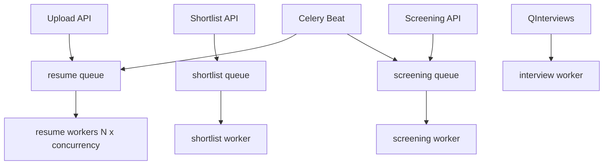

# Celery deployment guide

Production-grade background processing uses **named queues** so each workload can scale independently.

## Queue topology

| Queue | Tasks | Typical scale |
|-------|-------|---------------|
| `resume` | `process_resume_shortlist`, `recover_stuck_resume_processing`, `run_shortlist` (batch/force re-score) | **Horizontally scalable** — run N worker replicas |
| `shortlist` | Reserved queue name (currently routed into `resume`) | Keep for compatibility |
| `screening` | Vapi dial, webhook, transcript enrich, beat dispatch | 1–2 workers |
| `interviews` | Assessment scheduling, report generation | 1–2 workers |

Routing is centralized in [`app/core/celery_queues.py`](app/core/celery_queues.py) — producers do not pass `queue=` at enqueue time.



## Local development (Windows)

`start-dev.ps1` starts one worker on **all queues** with `--pool=solo`:

```powershell
.\start-dev.ps1
```

Equivalent manual command:

```powershell
cd backend
.\scripts\run-celery-worker.ps1 all
celery -A app.core.celery_app.celery_app beat --loglevel=info
```

## Production (Linux)

Use **prefork** pool (default on Linux) and dedicated workers per queue.

```bash
cd backend
chmod +x scripts/run-celery-worker.sh scripts/run-celery-beat.sh

# Scale resume processing — run multiple instances or systemd units
./scripts/run-celery-worker.sh resume

# Other workloads
./scripts/run-celery-worker.sh shortlist
./scripts/run-celery-worker.sh screening
./scripts/run-celery-worker.sh interviews

# Exactly ONE beat process per environment
./scripts/run-celery-beat.sh
```

### Concurrency tuning

Defaults live in [`app/core/config.yaml`](app/core/config.yaml) under `celery.queues.*.concurrency`.

Override per queue without editing YAML:

```bash
export CELERY_RESUME_CONCURRENCY=8
export CELERY_SCREENING_CONCURRENCY=2
```

### Capacity vs application limits

Resume upload dispatch is capped by `concurrency.max_resume_processing` (default 10) in the processing queue service.

Rule of thumb:

```
effective_resume_throughput ≈ resume_worker_replicas × resume_concurrency
max_resume_processing ≤ 0.8 × effective_resume_throughput
```

Leave headroom for OpenAI rate limits.

## Reliability settings

Configured in `celery_app.py` from YAML:

- `task_acks_late=true` — re-queue if worker dies mid-task
- `task_reject_on_worker_lost=true`
- `worker_prefetch_multiplier=1` — fair distribution for long GPT calls
- `task_track_started=true`

## Health checks

| Endpoint / helper | Purpose |
|-------------------|---------|
| `GET /api/health/celery` | Workers online, subscribed queues, Redis queue depths |
| `celery_queue_available("resume")` | Required before shortlist trigger; upload shows non-blocking warning if missing |
| `celery_queue_available("screening")` | Required before screening trigger (503 if missing) |

## Beat singleton

**Never run two Celery beat processes** in the same environment. Beat schedules:

- `dispatch_pending_screening_calls` — every 60s
- `recover_stuck_resume_processing` — every 120s

## Failure modes

| Symptom | Cause | Action |
|---------|-------|--------|
| Upload succeeds but resumes stay queued | No `resume` worker | Start resume worker; check `/api/health/celery` |
| Shortlist returns 503 | No `resume` worker | Start resume worker |
| Screening returns 503 | No `screening` worker | Start screening worker |
| Candidate stuck in `processing` | Worker crash | Beat recovers after 5 min; or retry from UI |

## Future: Docker / Kubernetes

Each `run-celery-worker.sh <queue>` maps 1:1 to a Deployment or systemd unit:

- `resume` Deployment — `replicas: N`, HPA on Redis queue depth
- `celery-beat` Deployment — `replicas: 1` always

Optional: [Flower](https://flower.readthedocs.io/) for live task monitoring (not included by default).

## Screening

Voice screening ops (live-call caps, webhook secret, dial retries): see [`DEPLOY-SCREENING.md`](DEPLOY-SCREENING.md).

## Interviews

LiveKit interview ops (webhook auth, join window, agent env, assessment retries): see [`DEPLOY-INTERVIEW.md`](DEPLOY-INTERVIEW.md).
