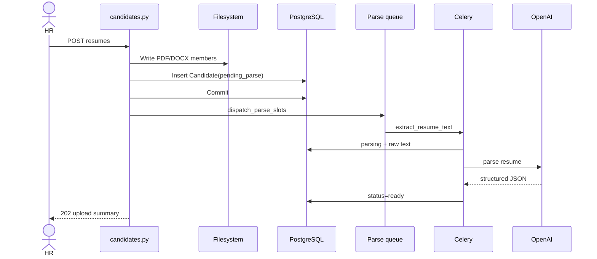
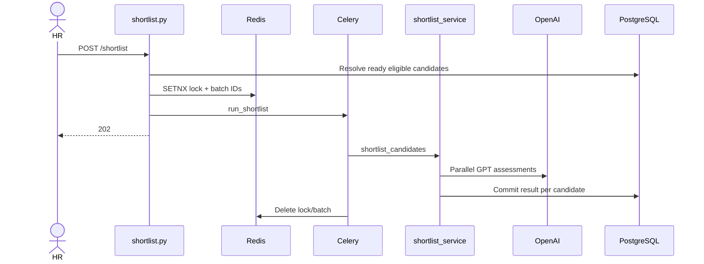
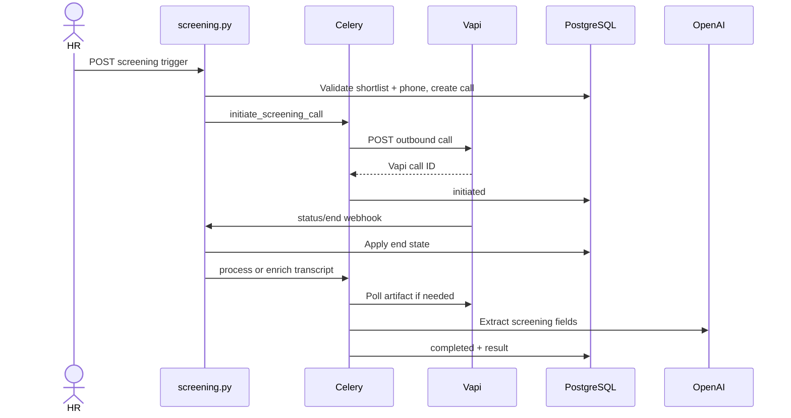
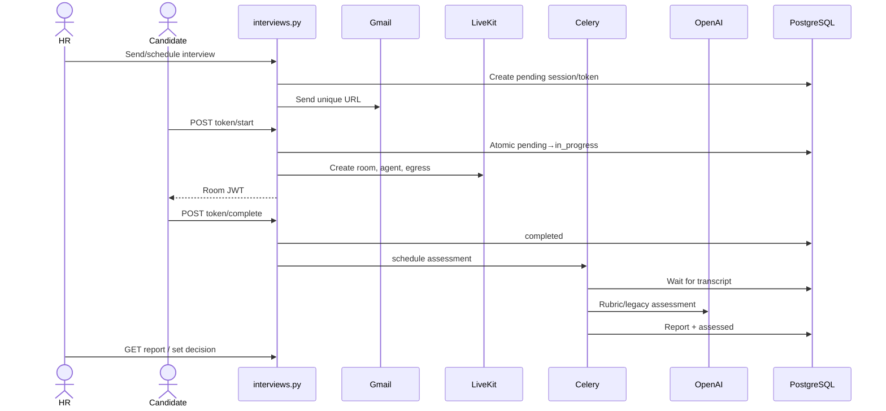

# Backend Application: Complete Onboarding and Architecture Guide

> Scope: every file under `backend/app/` (69 files).  
> This document is based on the implementation, not file-name inference.  
> Related Alembic migrations, frontend callers, and non-`app/` worker processes are mentioned only where they affect behavior.

---

# 1. What This Backend Does

This is a multi-tenant AI recruitment platform implemented as a FastAPI monolith with Celery workers.

An organization can:

1. Register and wait for platform approval.
2. Create jobs or parse a job description with OpenAI.
3. Upload individual resumes or ZIP archives.
4. Extract and parse resumes asynchronously.
5. Rank candidates with GPT assessment.
6. Record an HR shortlist decision.
7. Call approved candidates through Vapi for voice screening.
8. Invite passing candidates to a LiveKit video interview.
9. Generate an AI interview report.
10. Approve candidates as finalists.

The major technologies are:

- FastAPI and Pydantic for HTTP APIs and validation.
- SQLAlchemy async ORM with PostgreSQL.
- Redis as Celery broker/result backend and as a shortlist lock/status store.
- Celery workers and Celery Beat for background processing.
- OpenAI for parsing, ranking, extraction, and assessment.
- Vapi for outbound voice screening.
- LiveKit for video interviews, AI-agent dispatch, and recording.
- Gmail API for email.
- S3-compatible Linode Object Storage for interview recordings.

## Mental model

```text
Tenant
  └── Job
      └── Candidate
          ├── Resume parse
          ├── ShortlistResult
          ├── ScreeningCall
          └── InterviewSession
              └── InterviewReport
```

## Main candidate state flow

```text
Resume upload
  → pending_parse
  → parse_queued
  → parsing
  → parsed
  → ready
  → ShortlistResult
  → HR decision
  → ScreeningCall
  → InterviewSession
  → InterviewReport
  → Finalist
```

---

# 2. Application Startup and Request Lifecycle

## Startup

```text
ASGI server imports app.main:app
  ↓
Pydantic Settings reads environment and .env
  ↓
FastAPI application is constructed
  ↓
CORS middleware is registered
  ↓
All routers are mounted
  ↓
lifespan() opens a DB session
  ├── seed_admin_user()
  └── seed_superadmin_user()
  ↓
Application serves requests
```

Seed failures are logged and swallowed, so a failed seed does not prevent startup.

## Protected request lifecycle

```text
HTTP request
  ↓
CORSMiddleware
  ↓
FastAPI route match
  ↓
Pydantic path/query/body validation
  ↓
HTTPBearer extracts Authorization header
  ↓
get_current_user()
  ├── decode JWT
  ├── load User and Tenant
  ├── check user active
  ├── check tenant approved and active
  └── optionally apply superadmin tenant switch
  ↓
Role dependency
  ↓
Route handler
  ↓
Tenant-scoped query helper / service
  ↓
Database, external API, and/or Celery task
  ↓
Pydantic response serialization
```

## Background task lifecycle

```text
Route or service calls .delay() / .apply_async()
  ↓
Redis broker
  ↓
Celery synchronous task wrapper
  ↓
asyncio.run(async implementation)
  ↓
get_celery_db() creates a temporary NullPool engine
  ↓
Service / ORM / external API work
  ↓
Explicit commit
  ↓
Optional next task in pipeline
```

The disposable `NullPool` engine is intentional: tasks call `asyncio.run()`, which creates a new event loop for each invocation. Reusing pooled async database connections across those loops is unsafe, especially on Windows.

---

# 3. Folder Hierarchy

```text
backend/app/
├── __init__.py
├── main.py
├── api/
│   ├── __init__.py
│   └── routes/
│       ├── __init__.py
│       ├── auth.py
│       ├── audit.py
│       ├── candidates.py
│       ├── interviews.py
│       ├── jobs.py
│       ├── platform.py
│       ├── screening.py
│       ├── settings.py
│       ├── shortlist.py
│       └── users.py
├── core/
│   ├── __init__.py
│   ├── celery_app.py
│   ├── config.py
│   ├── database.py
│   ├── deps.py
│   ├── security.py
│   └── tenancy.py
├── models/
│   ├── __init__.py
│   └── models.py
├── schemas/
│   ├── __init__.py
│   └── schemas.py
├── services/
│   ├── __init__.py
│   ├── assessment_service.py
│   ├── audit_service.py
│   ├── call_window_service.py
│   ├── candidate_contact_service.py
│   ├── celery_health.py
│   ├── document_extractor.py
│   ├── email_service.py
│   ├── email_template_service.py
│   ├── expected_answer_service.py
│   ├── failed_screening_email_service.py
│   ├── gmail_service.py
│   ├── interview_finalist_service.py
│   ├── interview_flag_service.py
│   ├── interview_pipeline_service.py
│   ├── interview_question_constraints.py
│   ├── interview_reschedule_service.py
│   ├── interview_schedule_service.py
│   ├── interview_session_service.py
│   ├── interview_skip_screening_service.py
│   ├── jd_parser.py
│   ├── livekit_service.py
│   ├── mock_external.py
│   ├── parse_queue_service.py
│   ├── phone_validation.py
│   ├── report_refresh_service.py
│   ├── resume_parser.py
│   ├── s3_service.py
│   ├── screening_defaults.py
│   ├── screening_dispatch_service.py
│   ├── screening_trigger_service.py
│   ├── settings_service.py
│   ├── shortlist_service.py
│   ├── tenant_integrations_service.py
│   ├── tenant_service.py
│   ├── user_seed_service.py
│   ├── vapi_service.py
│   └── zip_extract_service.py
└── tasks/
    ├── __init__.py
    ├── interview_tasks.py
    ├── resume_tasks.py
    ├── screening_tasks.py
    └── shortlist_tasks.py
```

---

# 4. Root Folder

## Folder Overview

The root is the Python package and API composition layer. `main.py` is the ASGI entry point. All subpackages are imported through the `app.*` namespace.

## File: `__init__.py`

### Purpose and use

Marks `app` as a Python package. It contains only a descriptive comment and no executable logic, classes, or functions.

### Imports and importers

- Imports: none.
- Imported implicitly whenever any `app.*` module is loaded.

## File: `main.py`

### Purpose

Constructs the FastAPI application, configures middleware and error handling, performs startup seeding, defines health reporting, and mounts every router.

### Imports

- FastAPI, `Request`, `CORSMiddleware`, and `JSONResponse`.
- Every route module.
- `AsyncSessionLocal`.
- Mock-mode status helpers.
- User seed services.

### Important functions

#### `lifespan(_app: FastAPI)`

- Type: async context manager.
- Parameter: FastAPI instance; intentionally unused.
- Return: asynchronous lifespan generator.
- Logic:
  1. Open an `AsyncSessionLocal`.
  2. Try to seed the normal admin.
  3. Log and continue if that seed fails.
  4. Try to seed the superadmin.
  5. Log and continue if that seed fails.
  6. Yield control to the running application.
- Called by FastAPI once during process startup and shutdown.
- Complexity: O(number of seed queries), effectively O(1).
- Important behavior: failures do not fail startup.

#### `global_exception_handler(request, exc)`

- Handles any uncaught `Exception`.
- Returns status 500 with `{"error": exception class, "detail": str(exc)}`.
- Security concern: exposes internal exception details to clients.

#### `health()`

- Route: `GET /health`.
- Auth: none.
- Returns status, version, whether mock mode is active, and mocked service names.
- No database or external service health check is performed; this is only process liveness/config visibility.

### Router mounts

- `/api/auth` → `auth.router`
- `/api/platform` → `platform.router`
- `/api/users` → `users.router`
- `/api/audit-logs` → `audit.router`
- `/api/jobs` → `jobs.router`
- `/api` → candidates, shortlist, screening, interviews, settings

### Middleware

`CORSMiddleware` allows credentials, all methods, all headers, and a fixed set of local development origins. Production origins are not configurable in this file.

### Folder summary

The root composes the API but should not contain business logic. The main concern is the raw error-detail leak and development-only CORS list.

---

# 5. `core/`

## Folder Overview

`core` contains shared infrastructure needed by nearly every other folder: configuration, database sessions, authentication, authorization, tenant scoping, and Celery setup.

## File: `core/__init__.py`

Package marker only. No runtime symbols.

## File: `core/config.py`

### Class: `Settings(BaseSettings)`

Pydantic settings object loaded at import time. It uses `.env` and ignores unknown keys.

### Configuration variables

| Variable | Default | Purpose | Required |
|---|---:|---|---|
| `DATABASE_URL` | local async PostgreSQL | API and worker DB connections | Yes |
| `REDIS_URL` | `redis://localhost:6379` | Celery broker/backend and shortlist state | Yes for async features |
| `MOCK_EXTERNAL_APIS` | false | Mock every paid external integration | Optional |
| `MOCK_OPENAI` | false | Mock OpenAI only | Optional |
| `MOCK_VAPI` | false | Mock Vapi only | Optional |
| `MOCK_LIVEKIT` | false | Mock LiveKit only | Optional |
| `MOCK_EMAIL` | false | Mock email only | Optional |
| `OPENAI_API_KEY` | empty | Platform fallback OpenAI key | Per-tenant key may replace it |
| `VAPI_API_KEY` | empty | Platform fallback Vapi key | Per-tenant key may replace it |
| `VAPI_PHONE_NUMBER_ID` | empty | Outbound caller ID | Required for Vapi |
| `BACKEND_PUBLIC_URL` | empty | Builds Vapi webhook URL | Required for webhooks |
| `SARVAM_API_KEY` | empty | Present but unused in reviewed `app/` code | No current consumer |
| `LIVEKIT_API_KEY/SECRET/URL` | empty | LiveKit fallback credentials | Required for interviews |
| `INTERVIEW_ASSESSMENT_MODEL` | `gpt-4o-mini` | GPT interview assessment model | Optional override |
| `S3_*` | Linode Chennai defaults | LiveKit recording upload and playback | Optional |
| `CANDIDATE_APP_URL` | localhost:5174 | Candidate interview links | Required for real emails |
| `HR_APP_URL` | localhost:5173 | Invite links | Required for real emails |
| `GMAIL_CREDENTIALS_PATH` | `credentials.json` | OAuth client credentials | Required for Gmail |
| `GMAIL_TOKEN_PATH` | `token.json` | OAuth refresh/access token | Required for Gmail |
| `UPLOAD_DIR` | `uploads/resumes` | Resume filesystem storage | Required |
| `ORG_DOCS_DIR` | `uploads/org-docs` | GST document storage | Required |
| `MAX_ORG_DOC_SIZE` | 10 MiB | GST upload limit | Optional |
| `MAX_CONCURRENT_PARSES` | 10 | Active parses per job | Optional |
| `MAX_CONCURRENT_SHORTLISTS` | 10 | Parallel GPT shortlist calls | Optional |
| `MAX_ZIP_FILE_SIZE` | 100 MiB | ZIP input limit | Optional |
| `MAX_RESUMES_PER_ZIP` | 200 | ZIP member count limit | Optional |
| `MAX_ZIP_UNCOMPRESSED_BYTES` | 500 MiB | ZIP bomb limit | Optional |
| `JWT_SECRET_KEY` | insecure development string | JWT signing | Must change in production |
| `INTEGRATIONS_ENCRYPTION_KEY` | empty, falls back to JWT secret | Fernet secret encryption | Strongly recommended |
| `JWT_ALGORITHM` | HS256 | JWT algorithm | Optional |
| `JWT_EXPIRE_MINUTES` | 480 | Access-token lifetime | Optional |
| `SEED_ADMIN_*` | mostly empty | Startup tenant admin | Optional |
| `SEED_SUPERADMIN_*` | mostly empty | Startup platform admin | Optional |

`settings = Settings()` is constructed at import time. Invalid environment values therefore fail module import/startup.

## File: `core/database.py`

### Module objects

- `engine`: persistent async API engine with pre-ping.
- `AsyncSessionLocal`: request session factory; no autocommit/autoflush; objects remain usable after commit.
- `Base`: declarative model base.

### `get_db()`

- FastAPI dependency.
- Yields one `AsyncSession`.
- Always closes it.
- Does not auto-commit or explicitly roll back; route code controls transactions.

### `get_celery_db()`

- Async context manager for tasks.
- Creates a new `NullPool` engine and session factory for every invocation.
- Yields a session, closes it, then disposes the engine.
- Higher connection overhead is accepted to prevent cross-event-loop reuse.

## File: `core/security.py`

### Functions

#### `hash_password(password: str) -> str`

Hashes with Passlib bcrypt. CPU-bound and called synchronously, including inside async routes.

#### `verify_password(plain_password, hashed_password) -> bool`

Verifies bcrypt. Raises if the stored hash is malformed.

#### `create_access_token(subject, extra_claims=None) -> str`

Builds `sub` and UTC `exp`, merges caller claims, and signs with configured algorithm/secret.

#### `decode_token(token) -> dict`

Validates signature and expiry. Converts PyJWT `InvalidTokenError` into `ValueError`.

## File: `core/deps.py`

### `get_current_user(credentials, db) -> User`

Complete behavior:

1. Require a Bearer header; otherwise 401 with `WWW-Authenticate`.
2. Decode JWT and parse `sub` as UUID.
3. Load user and eager-load tenant.
4. Reject missing user, inactive user, pending/rejected/inactive non-superadmin tenant.
5. Record home and active tenant metadata.
6. Detach the user from the session so a request-only superadmin tenant switch cannot flush.
7. If superadmin JWT contains `active_tenant_id`, load and validate the selected tenant and replace the detached user's `tenant_id`.
8. Attach helper attributes used by responses.

The function performs O(1) indexed DB lookups.

### `require_roles(*allowed_roles)`

Factory returning a dependency that calls `get_current_user` and rejects roles not in the supplied set.

### Exported role aliases

- `RequireAdminOrHr`: admin, hr, superadmin.
- `RequireAdmin`: admin, superadmin.
- `RequireSuperAdmin`: superadmin.
- `hr_roles` and `admin_roles`: reusable route-level dependencies.

## File: `core/tenancy.py`

### Functions

- `slugify(name)`: lowercase, replace non-alphanumeric groups with `-`, trim, default to `org`, cap at 80.
- `get_tenant_job(db, job_id, tenant_id)`: fetch job in tenant or 404.
- `get_tenant_candidate(...)`: join Candidate→Job and enforce tenant or 404.
- `get_tenant_shortlist_result(...)`: join result→Job and enforce tenant.
- `get_tenant_screening_call(...)`: join call→Job and enforce tenant.
- `ensure_unique_slug(db, name)`: query-loop adding `-2`, `-3`, etc. It can race under concurrent tenant creation.
- `require_user_tenant(user)`: return tenant ID or 403.

Each getter intentionally returns 404 for cross-tenant IDs so callers cannot distinguish unauthorized resources from absent ones.

## File: `core/celery_app.py`

Creates the Celery application with Redis as broker and backend. It imports all four task modules.

### Beat schedule

- Every 60 seconds: `tasks.dispatch_pending_screening_calls`.
- Every 120 seconds: `tasks.recover_stuck_resume_parses`.

`tasks.dispatch_scheduled_interview_emails` exists but is not in this schedule.

### Core folder summary

This folder is the infrastructure backbone. Risks: insecure default JWT secret, synchronous bcrypt in async routes, non-configurable production CORS, and process-local settings behavior elsewhere.

---

# 6. `models/`

## Folder Overview

All ORM classes are kept in one file. They inherit from `core.database.Base`. PostgreSQL-specific ARRAY, JSON, and UUID types make the application PostgreSQL-specific.

## File: `models/__init__.py`

Package marker only.

## File: `models/models.py`

## Model: `Tenant`

- Table: `tenants`.
- Primary key: UUID, generated with `uuid4`.
- `name`: required `String(255)`.
- `slug`: required unique indexed `String(80)`.
- `is_active`: required boolean, Python/server default true.
- `verification_status`: required string, default `approved`; application values are pending/approved/rejected.
- `company_registration_number`: optional string.
- `gst_document_path`: optional local filesystem path.
- `gst_document_filename`: optional original filename.
- `created_at`: server timestamp.
- Relationships: users, jobs, settings (one-to-one), invites.
- Child deletion uses ORM delete-orphan and DB cascade.
- APIs: signup, all platform tenant APIs, auth checks.

## Model: `TenantInvite`

- Table: `tenant_invites`.
- UUID primary key.
- Required indexed tenant FK with cascade.
- Required indexed email.
- Required role string, default `hr`.
- Required unique indexed bearer token.
- Optional inviter user FK with SET NULL.
- Required expiry; optional acceptance timestamp.
- CRUD: create/list/revoke/accept.
- Missing constraint: no uniqueness preventing multiple active invites for the same tenant/email.

## Model: `User`

- Table: `users`.
- UUID primary key.
- Required indexed tenant FK with cascade.
- Globally unique indexed email.
- Required full name and bcrypt hash.
- Required role string; app uses superadmin/admin/hr.
- Active flag and timestamps.
- The global email uniqueness prevents one email from joining multiple tenants.

## Model: `Job`

- Table: `jobs`.
- UUID primary key and indexed tenant FK.
- Required title/description.
- Optional required-skills PostgreSQL array.
- Required minimum/maximum experience integers.
- Screening and interview questions stored as JSON lists.
- Optional screening call start/end times.
- Required timezone, default `Asia/Kolkata`.
- Required status, default active.
- Relationships cascade to candidates, shortlist results, screening calls, and interview sessions.

## Model: `Candidate`

- Table: `candidates`.
- UUID primary key and required job FK.
- Required name/email; optional phone.
- Optional saved resume path and original filename.
- Optional extracted text and parsed JSON.
- Required parse status, initially `pending_parse`.
- Relationships cascade to shortlist results, screening calls, and interview sessions.
- No DB uniqueness on `(job_id, original_filename)` despite application deduplication.

## Model: `ShortlistResult`

- Table: `shortlist_results`.
- Candidate and job FKs, both cascading.
- Required match score and recommendation.
- Optional ARRAY strengths/gaps and reason.
- Required HR decision, default pending.
- Optional HR feedback type/comments.
- No DB uniqueness on `(candidate_id, job_id)`, although service code treats it as an upsert key.

## Model: `ScreeningCall`

- Table: `screening_calls`.
- Candidate/job FKs.
- Optional Vapi call ID.
- Required call status.
- Extracted screening fields: availability, employment, experience, CTC, notice, location, communication, willingness, summary, result, transcript.
- Retry metadata: ended reason, retry count, call outcome.
- Interview-queue and failed-email tracking timestamps/status.
- Used by Vapi tasks, screening APIs, and interview eligibility.

## Model: `SystemSettings`

- Table: `system_settings`.
- Integer primary key.
- Required unique indexed tenant FK.
- Phone region JSON and enforcement flag.
- Screening enabled, max retries, retry delay.
- Optional email-template JSON.
- Company name.
- Optional encrypted integration JSON.
- One row per tenant.

## Model: `InterviewSession`

- Table: `interview_sessions`.
- Candidate/job FKs.
- Unique link token.
- Optional LiveKit room name.
- Status and HR decision.
- Email/start/completion timestamps.
- Transcript, egress ID, recording key.
- Expiry and scheduled time.
- Optional self-FK identifying the previous rescheduled session.
- One-to-one report relationship.

## Model: `InterviewReport`

- Table: `interview_reports`.
- Session, candidate, and job FKs.
- Summary and transcript summary.
- Legacy dimension scores plus overall score.
- Strengths/weaknesses arrays, JD fit, final recommendation.
- Raw JSON supports rubric-based output and detailed question scores.
- Important missing constraint: session FK is not declared unique even though ORM relationship is one-to-one and tasks assume one report.

## Model: `AuditLog`

- Table: `audit_logs`.
- UUID primary key and timestamp.
- Optional indexed tenant/actor FKs with SET NULL.
- Denormalized actor name/role.
- Action, entity type/ID, subject label, feature.
- Optional before/after JSON.
- Optional indexed job ID without an FK.
- Tenant deletion sets `tenant_id` to NULL; the tenant-filtered audit endpoint can no longer retrieve that deletion record.

### Models folder summary

Eleven tables implement shared-database multi-tenancy. The most important data-integrity improvements are unique constraints for shortlist candidate/job, report/session, candidate filename/job, and active invites.

---

# 7. `schemas/`

## Folder Overview

Pydantic models define HTTP request/response contracts. `from_attributes=True` allows responses from ORM objects.

## File: `schemas/__init__.py`

Package marker only.

## File: `schemas/schemas.py`

### Question helpers

- `_normalize_screening_questions`: accepts schema/dict items, generates missing UUIDs, trims and rejects empty text. Unknown item types are silently skipped.
- `_normalize_interview_questions`: generates IDs, converts scores, normalizes expected points, requires score ≥1, and runs oral/technical constraints.
- `_strip_expected_points_from_questions`: prevents expected-answer guidance leaking through public job responses.

### Job schemas

- `InterviewQuestionPublic`: ID, question, positive score.
- `InterviewQuestion`: adds optional expected points.
- `ScreeningQuestion`: ID and text.
- `JobCreate`: create fields; default question lists; before-validator normalizes questions.
- `JobUpdate`: optional fields including call window/timezone.
- `JobResponse`: ORM response; null question lists become empty; computed total interview score; expected points removed.
- `JobParseResponse`: fields returned by JD parsing.

### Settings and template schemas

- `SystemSettingsResponse`: geography, screening retry behavior, company, updated time.
- `SystemSettingsUpdate`: optional patch fields.
- `EmailTemplateEntry`: subject, HTML, version, timestamp.
- `EmailTemplatesResponse`: templates, placeholder catalogs, company.
- `EmailTemplateUpdate`, `EmailTemplatePreviewRequest/Response`, `EmailTemplateTestRequest`.
- Validation gap: test recipient is `str`, not `EmailStr`.

### Candidate schemas

- `CandidateCreate`: job/contact data; not used by resume upload.
- `CandidateUpdate`: optional name/email/phone; fields are not `EmailStr`.
- `CandidateResponse`: exposes raw resume text and parsed data to authorized HR/admin users.
- `ResumeUploadResponse`: created/skipped IDs and ZIP statistics.

### Shortlist schemas

- `ShortlistResultResponse` and candidate-enriched subtype.
- `ShortlistDecisionUpdate/Response`.
- `ShortlistFeedbackCreate`.
- `ShortlistTriggerRequest`.
- `ShortlistStatusResponse`.
- Decision and feedback value sets are mostly enforced in route code rather than Literals.

### Screening schemas

- `ScreeningTriggerRequest/Response`.
- `ScreeningCallResponse`.
- `ScreeningResultUpdate`.

### Interview schemas

- `InterviewSessionResponse`: stored and enriched fields, including interview URL and mock mode.
- `InterviewHrDecisionUpdate`: approved/rejected Literal.
- `InterviewScheduleRequest`: date/time strings and IANA timezone.
- `InterviewStartResponse`: room, LiveKit token, URL.
- Pipeline count/candidate/response models.
- Finalist models.
- Point coverage, question score, and full report response.

### Auth, tenant, user, and audit schemas

- Login/token/user response.
- `SignupRequest` exists but multipart signup does not use it.
- Invite create/list/public/accept schemas.
- Tenant switch/create/update/response/list schemas.
- User create/update schemas.
- Audit item and paginated list.

### Schemas folder summary

Schemas provide a strong typed boundary, but domain values are inconsistently expressed: some use `Literal`, while others rely on route string sets. Mutable list defaults are accepted by Pydantic v2 but `default_factory` would be clearer.

---

# 8. `api/` and `api/routes/`

## Folder Overview

Route modules translate HTTP requests into service calls and ORM changes. They also contain significant orchestration, especially screening and interviews.

## Package marker files

`api/__init__.py` and `api/routes/__init__.py` contain comments only and no symbols.

## File: `routes/auth.py`

### Helpers

- `_user_response`: serializes user plus home/active tenant context.
- `_issue_token`: creates role/email/home-tenant claims and optional superadmin active tenant claim.
- `_assert_tenant_can_access`: rejects pending, rejected, or inactive organizations.
- `_read_and_validate_gst_pdf`: extension, nonempty, size, and `%PDF` signature checks; reads entire file in memory.
- `_persist_gst_document`: synchronously writes a randomized PDF path.

### Endpoints

#### `POST /api/auth/signup`

- Public multipart endpoint.
- Fields: organization, email, password, full name, optional registration number, required GST PDF.
- Creates pending inactive tenant, settings, and active admin; writes PDF; commits.
- Returns 201 pending response.
- Errors: 400 validation, 409 duplicate email, automatic 422 for missing form fields.
- Issues: email is plain string, synchronous file/bcrypt work, orphan file on commit failure, no rate limit, signature-only PDF validation.

#### `POST /api/auth/login`

- Body: `LoginRequest`.
- Loads user+tenant, bcrypt verifies, checks status, returns JWT.
- Errors: 401 invalid credentials, 403 inactive/pending/rejected org.
- No throttling, MFA, lockout, refresh/revocation, issuer, audience, or JTI.

#### `GET /api/auth/me`

Returns the dependency-resolved current user.

#### `POST /api/auth/switch-tenant`

Superadmin only. Validates approved active non-platform tenant and issues a JWT with `active_tenant_id`.

#### `POST /api/auth/clear-tenant-switch`

Superadmin only. Reissues a token without active tenant claim.

#### `GET /api/auth/invites/{token}`

Public bearer-token lookup revealing invite email, role, organization, and expiry.

#### `POST /api/auth/accept-invite`

Validates invite and tenant, creates user, marks accepted, commits, and issues JWT. Concurrent acceptance is not locked.

## File: `routes/users.py`

- `_invite_url`: builds HR-app acceptance URL.
- `GET /api/users`: unpaginated tenant user list.
- `POST /api/users`: directly creates user and audit record.
- `GET /api/users/invites`: lists unaccepted pending/expired invites including token URL.
- `DELETE /api/users/invites/{id}`: revokes an unaccepted tenant invite.
- `POST /api/users/invites`: creates seven-day token, commits, sends Gmail, returns token and `email_sent`.
- `PATCH /api/users/{id}`: updates name/role/password/active; prevents self-demotion/deactivation.
- `DELETE /api/users/{id}`: prevents self-delete and hard-deletes.
- Issues: no last-admin protection, admins can manage peer admins, synchronous Gmail/bcrypt, no pagination, duplicate-invite race.

## File: `routes/platform.py`

- `_tenant_list_item`: combines Tenant with counts and earliest admin.
- `GET /api/platform/tenants`: four DB queries, unpaginated.
- `POST /api/platform/tenants`: creates approved tenant/admin.
- `PATCH /api/platform/tenants/{id}`: rename/active update.
- `POST .../approve`: approved + active.
- `POST .../reject`: rejected + inactive.
- `GET .../gst-document`: streams stored path.
- `GET .../users`: tenant users.
- `DELETE .../{id}`: audit, hard-delete cascades, then unlink GST file.
- Issues: file cleanup after commit can report 500 after successful deletion; resume/recording cleanup is absent; deletion audit becomes unreachable by tenant-filtered endpoint.

## File: `routes/audit.py`

### `GET /api/audit-logs`

- Admin/superadmin.
- Query: limit 1–200, offset, entity type, job/user UUID, text search, from/to timestamps.
- Always tenant-scoped.
- Executes count and page query.
- Search uses leading-wildcard `ILIKE` across four columns and can be slow.
- Offset pagination degrades at high offsets.

## File: `routes/settings.py`

- `_get_or_create_settings`: GET may create and commit defaults.
- `GET /api/settings`: admin/hr read.
- `PATCH /api/settings`: admin updates regions, enforcement, screening, retry limits, company; writes per-field audits and invalidates local cache.
- `_email_templates_response`: merges stored/default templates.
- Template GET/PATCH/restore/preview/test endpoints.
- Risks: template save/restore commits before audit; arbitrary unsanitized HTML; test email target not email-validated; Gmail runs synchronously.

## File: `routes/jobs.py`

### Helpers

- `_is_allowed_jd_file`: content type OR extension check.
- `_serialize_job_field`: converts date/time-like values to ISO for audits.

### Endpoints

- `POST /api/jobs`: default screening questions; if interview questions exist, require OpenAI and enrich expected points; insert/audit/commit.
- `GET /api/jobs`: tenant list, optional exact status.
- `POST /api/jobs/parse-jd`: up to 20 MiB PDF/DOCX, text extraction, OpenAI parse, typed response.
- `GET /api/jobs/{id}`: tenant-scoped.
- `PATCH /api/jobs/{id}`: optional expected-points enrichment, field audits, commit.
- `DELETE /api/jobs/{id}`: audit and cascade.

## File: `routes/candidates.py`

### Helpers

- `_is_allowed_file`, `_is_zip_file`, `_is_allowed_upload`: content type OR suffix.
- `_ingest_resume_file`: enforce 20 MiB member limit, basename normalization, application-level filename dedup, synchronous disk write, Candidate insert with placeholder email.

### Endpoints

- `POST /api/jobs/{job}/resumes`: validates all uploads, expands safe ZIPs, writes files, creates/audits candidates, commits, and dispatches parse slots. Returns 202.
- `GET /api/jobs/{job}/candidates`: optional comma-separated parse statuses and shortlist existence.
- `GET /api/candidates/{id}`.
- `POST /api/jobs/{job}/candidates/{id}/retry-parse`: resets supported statuses and dispatches.
- `DELETE /api/candidates/{id}`: cascades DB rows but does not delete resume file.
- `PATCH /api/candidates/{id}`: contact fields.

Race concern: duplicate filename check lacks DB uniqueness. File writes occur before transaction commit.

## File: `routes/shortlist.py`

### Helpers

- Redis client and key builders.
- `_resolve_eligible_candidate_ids`: ready, same job, no result; reports skipped reasons.

### Endpoints

- `POST /api/jobs/{job}/shortlist`: acquire five-minute Redis lock, store ten-minute batch, enqueue task, audit, return 202.
- `GET .../status`: Redis lock/batch plus DB completion count; Redis errors soft-fail to empty.
- `GET .../shortlist`: ordered results enriched with candidate parsed contact.
- `PATCH /api/shortlist/{id}/decision`: validate decision; audit; send rejection email; approved candidates either bypass screening or auto-dispatch within call window.
- `POST /api/shortlist/{id}/feedback`: update HR feedback.

The decision endpoint is highly coupled to settings, email, Celery health, screening, call windows, and interview creation.

## File: `routes/screening.py`

### Endpoints

- `POST /api/jobs/{job}/screening/trigger`: requires workers, enabled setting, candidate UUID parsing; delegates eligibility and enqueue; returns initiated/queued/skipped.
- `POST /api/screening/webhook`: public Vapi webhook. Handles status updates and end reports, parks calls waiting for transcripts, schedules processing/enrichment, or fallback polling.
- `GET /api/jobs/{job}/screening`: loads calls; synchronously attempts a five-second live refresh then falls back to Celery.
- `POST /api/screening/{id}/refresh`: poll one live call.
- `PATCH /api/screening/{id}/result`: HR override only after call completed.

Critical security issue: webhook authenticity is not verified.

## File: `routes/interviews.py`

This is the largest route module and orchestrates most interview lifecycle operations.

### Helpers

- `_candidate_label`: candidate name, filename, or UUID.
- `_get_latest_pass_screening_call`: newest completed pass.
- `_mark_interview_queued`: require pass and set queue timestamp.

### HR endpoints

- Queue candidate for interview.
- Schedule for a future datetime and email immediately.
- Send an unscheduled interview link.
- Force-complete an active interview.
- Read latest report and refresh missing rubric coverage.
- List job sessions.
- Build pipeline tabs/counts.
- List finalists.
- Approve/reject post-interview.
- Reschedule.
- Retry failed assessment.

### Candidate token endpoints

- `GET /api/interview/{token}`: returns session details and marks expired links.
- `POST /api/interview/{token}/start`: atomically claims pending session, creates LiveKit room/agent/egress, returns candidate token; supports rejoin.
- `POST /api/interview/{token}/complete`: completes and schedules assessment.

### Webhook

`POST /api/livekit/webhook` handles `room_finished`, completes the session, and schedules assessment if no report.

### Important issues

- LiveKit webhook has no signature validation.
- The start endpoint commits `in_progress` before room creation. A LiveKit failure leaves an in-progress session with no room; subsequent calls may not cleanly retry.
- HR force-complete inserts a realistic stub transcript if no meaningful transcript exists, creating potentially misleading evidence.
- Candidate link token is the only authorization on public interview endpoints.
- Large module should be split into HR command, candidate session, report, pipeline, and webhook routers.

### API folder summary

The folder exposes the full product. Authentication and tenant filters are generally explicit. Webhook authentication, blocking work in async routes, and large orchestration handlers are the primary concerns.

---

# 9. `services/`

## Folder Overview

The service folder holds business logic, reusable validators, queueing helpers, and external adapters. `services/__init__.py` is only a package marker.

## File-by-file service catalog

## `assessment_service.py`

Generates interview assessments in rubric mode when job interview questions exist and legacy dimension mode otherwise.

Important functions:

- `_rubric_assessment_prompt`: constructs strict scoring JSON instructions.
- `_build_needs_review_report`: safe fallback for missing/short transcripts or GPT failure.
- `_empty_question_score_entry`: zero/unknown score shell.
- `_coerce_expected_points`, `rubric_has_expected_points`.
- `question_scores_need_coverage_refresh`: detects old report format.
- `_normalize_point_coverage` and `_coverage_earned_score`.
- `_normalize_rubric_questions`: sanitizes stored rubric.
- `_merge_rubric_scores`: aligns GPT scores to rubric IDs and calculates totals.
- `_run_gpt_assessment`: OpenAI JSON call.
- `_build_user_content`: transcript, job, and candidate context.
- `generate_assessment`: public async entry; mock support; returns fallback rather than propagating most assessment failures.

Complexity is O(number of questions × expected points + transcript prompt size), excluding network latency.

## `audit_service.py`

- `_redact_value`: masks values when key names contain password/token/secret.
- `redact_state`: shallow top-level redaction.
- `log_change`: creates one AuditLog in caller transaction.
- `log_field_changes`: creates one event per actually changed field.

Nested secrets are not recursively redacted.

## `call_window_service.py`

Defines a `CallWindowJob` Protocol and functions to interpret job call times/timezone.

- `_job_from`, `_job_to`, `_job_tz`.
- `_time_in_window`: supports normal and overnight windows.
- `is_within_call_window`.
- `seconds_until_next_window`.
- `effective_dispatch_delay`: returns countdown and whether execution is immediate, honoring force/minimum delay.

## `candidate_contact_service.py`

- `resolve_candidate_email`: prefer parsed email, reject upload placeholder.
- `resolve_candidate_name`: prefer parsed name, then stored name/filename.

Centralizes placeholder handling that would otherwise be duplicated.

## `celery_health.py`

`celery_workers_available(timeout=2.0)` pings Celery workers and returns a boolean. Used before screening trigger. It adds up to two seconds to a request and can report unavailable during transient control-plane delays.

## `document_extractor.py`

`extract_text_from_bytes(content, filename)` dispatches by suffix:

- PDF via PyMuPDF.
- DOCX/DOC via python-docx.
- Raises `ValueError` for unsupported extensions.

Legacy binary `.doc` is accepted by extension but python-docx generally cannot parse true binary Word documents.

## `email_template_service.py`

Owns four template IDs: failed screening attempt, interview invitation, interview reschedule, and rejection.

- `default_templates`: deep-copyable defaults.
- `merge_templates`: overlays stored customizations.
- `validate_template`: known ID, nonblank content, required placeholders.
- `render_template` / `preview_template`: simple string replacement.
- `get_company_name`, `get_merged_templates`.
- `save_template`: increments version and commits internally.
- `restore_template`: removes override and commits internally.

Unknown placeholders remain. HTML and substitutions are not sanitized/escaped.

## `email_service.py`

High-level email façade. It contains HTML builders and async functions:

- `send_interview_link`.
- `send_scheduled_interview_notification`.
- `send_reschedule_notification`.
- `send_failed_screening_attempt_email`.
- `send_rejection_email`.
- `send_org_invite_email`.

Functions use mock mode or synchronous Gmail helpers and return `True/False` rather than raising. Candidate/job/org strings are interpolated into HTML without HTML escaping.

## `expected_answer_service.py`

- `_job_context`: compact job context.
- `generate_expected_points`: asks OpenAI for expected answer points for one question.
- `_existing_by_id`: maps existing questions.
- `enrich_interview_questions`: retains existing expected points where possible and generates missing ones.

Question enrichment makes job create/update dependent on OpenAI availability.

## `failed_screening_email_service.py`

- `_is_valid_email`.
- `_would_be_flagged_after_failure`: considers retry limits/current state.
- `maybe_send_failed_screening_email`: idempotency checks and best-effort send.

Its purpose is to avoid emailing a false failure before late Vapi transcript enrichment finishes.

## `gmail_service.py`

### Class `GmailNotConfiguredError(RuntimeError)`

Signals absent OAuth configuration.

### Functions

- `_backend_dir`, `_resolve_path`: resolve credential paths.
- `load_credentials`: read token, refresh if expired, persist refreshed token.
- `run_interactive_oauth`: local OAuth browser flow.
- `_send_mime_message`: Gmail API send.
- `send_html_email`, `send_plain_email`: mock-aware, catch/log all failures, return bool.

OAuth/file/network operations are synchronous.

## `interview_finalist_service.py`

- `_session_is_completed_for_decision`.
- `_experience_years`: pulls parsed resume experience.
- `_map_recommendation_label`.
- `set_interview_hr_decision`: require suitable completed/assessed session.
- `list_finalists`: join approved sessions with candidate, report, and latest screening compensation fields.

## `interview_flag_service.py`

- `has_meaningful_transcript`: minimum non-whitespace characters.
- `_is_expired`.
- `get_flag_reason`: reports never-started/expired/no transcript/no report conditions.
- `is_flagged_session`.

## `interview_pipeline_service.py`

- Maps recommendation labels.
- Determines assessment status.
- Determines HR decision and active-session state.
- `classify_interview_tab`: pending, scheduled, ongoing, completed, flagged, or finalists.
- `_enrich_session`.
- `get_interview_pipeline`: loads candidates/sessions/reports and returns counts plus optional tab-filtered candidates.

## `interview_question_constraints.py`

Regex/keyword heuristics prevent questions unsuitable for an oral AI interview.

- `derive_difficulty_hint`.
- `question_requires_live_coding`.
- `question_is_behavioural`.
- `validate_oral_interview_question`.
- `validate_technical_interview_question`.
- `validate_interview_question`.
- `validate_oral_interview_questions`.

Heuristic validation can have false positives/negatives and should not be treated as a security boundary.

## `interview_reschedule_service.py`

- Finds latest passing screening call.
- Expires previous session.
- Optionally parses new schedule.
- Creates a replacement session linked by `rescheduled_from_session_id`.
- Sends reschedule email.
- Returns enriched response.

Concurrency can create multiple replacement sessions because active-session checks are not backed by a partial unique constraint.

## `interview_schedule_service.py`

- `parse_scheduled_at`: parse date/time and IANA timezone, convert to UTC.
- `format_scheduled_at_label`.
- `send_interview_invitation_email`.
- `send_scheduled_interview_notification_email`.
- `dispatch_due_scheduled_interview_emails`.

The route currently sends scheduled notifications immediately. The due-email dispatcher is implemented but not registered in Beat.

## `interview_session_service.py`

- `get_active_interview_session`: newest pending/in-progress session.
- `create_pending_interview_session`: validate candidate/job, reject existing active session, create UUID token and seven-day expiry.

## `interview_skip_screening_service.py`

### Class `AdvanceResult`

Dataclass returning session ID and whether email was sent.

### Functions

- `_ensure_bypass_screening_call`: creates a synthetic completed pass call when screening is disabled.
- `_send_invitation_if_needed`.
- `advance_approved_candidate_to_interview`: orchestrates bypass call, pending session, commit/email behavior.

## `jd_parser.py`

Normalizes GPT output:

- screening questions receive IDs and defaults.
- oral/technical interview questions are filtered by constraints.
- parsed questions are normalized to public shape.
- `parse_job_description` calls OpenAI JSON mode or deterministic mock.

## `livekit_service.py`

- `_livekit_http_url`: converts ws/wss URL to HTTP/HTTPS for REST.
- `_livekit_credentials`.
- `_s3_configured`.
- `create_room`: create room, attempt AI-agent dispatch, attempt composite MP4 egress, close SDK client.
- `generate_candidate_token`: two-hour publish/subscribe room token.
- `generate_agent_token`: two-hour agent token with elevated grants.

Agent dispatch and recording failures are soft warnings after room creation. Candidate identity is derived from name and may collide for same-name participants.

## `mock_external.py`

Granular mock flags and deterministic stand-ins:

- enabled checks and active service list.
- resume/JD parsing.
- shortlist and interview assessment.
- expected points and screening extraction.
- fake Vapi call data/ID.
- fake LiveKit token.
- fake email send.

Mock resume data contains fixed personal-looking contact details, which can confuse demonstrations and logs.

## `parse_queue_service.py`

- Active statuses: parse_queued, parsing, parsed.
- Five-minute stuck timeout.
- `_count_active_parses`.
- `recover_stuck_parses`.
- `dispatch_parse_slots`: count active, claim oldest pending rows by setting parse_queued, enqueue extraction, commit.

Concurrency issue: two API processes can count and claim the same capacity without row locking, exceeding the configured limit. Stuck detection uses Candidate `created_at`, not the time status changed, so an old candidate is immediately considered stuck if a fresh retry remains queued briefly.

## `phone_validation.py`

- `_strip_digits`.
- `_normalize_indian`: normalizes 10-digit India numbers and country prefix.
- `validate_phone_sync`.
- `validate_phone`.
- `validate_phone_with_reason`.

Loads allowed regions/enforcement from tenant settings.

## `report_refresh_service.py`

- `apply_assessment_to_report`.
- `ensure_job_expected_points`: enrich old job questions.
- `ensure_report_has_coverage`: regenerates assessment when point coverage is missing.

Reading a report can therefore trigger OpenAI work and DB writes, making GET non-read-only and potentially slow/expensive.

## `resume_parser.py`

- `_parse_resume_sync`: OpenAI JSON parsing.
- `parse_resume`: mock-aware async thread wrapper.

Returns structured identity/contact, skills, experience, education, current company/role.

## `s3_service.py`

- `s3_configured`.
- `_s3_client`: cached boto3-compatible client.
- `generate_presigned_get_url`: one-hour default URL; returns `None` on missing config/failure.

## `screening_defaults.py`

- `get_default_screening_questions`.
- `merge_screening_questions`.
- `format_screening_questions_for_prompt`.

Guarantees a baseline HR screening script and avoids duplicating prompt formatting.

## `screening_dispatch_service.py`

`enqueue_screening_call(screening_call_id, job, force=False)` calculates the call-window delay and calls `tasks.initiate_screening_call.apply_async`. Returns whether dispatch is immediate.

## `screening_trigger_service.py`

- Checks live/any/scheduled calls.
- Finds approved candidates not previously called.
- `dispatch_screening_for_candidates`: validate job membership, shortlist approval, duplicate live call, phone; create ScreeningCall rows; commit; enqueue.
- `auto_dispatch_unqueued_approved_for_job`.

Per-candidate query loops create N+1 behavior for large batches.

## `settings_service.py`

### Class `CachedSettings`

Dataclass containing normalized tenant runtime settings.

### Functions

- defaults and retry normalization.
- `can_schedule_retry`.
- row-to-dataclass conversion.
- `load_system_settings`.
- `get_system_settings`: process-local TTL cache.
- `invalidate_settings_cache`.

Cache invalidation is not distributed, so other API/worker processes can remain stale.

## `shortlist_service.py`

- Candidate/JD summary builders.
- `_gpt4o_assess`: GPT-4o JSON assessment.
- `_upsert_shortlist_result`: application-level upsert.
- `_score_and_persist_candidate`: semaphore-limited GPT; DB writes serialized by asyncio lock.
- `shortlist_candidates`: load job/integrations/candidates, skip already scored, gather parallel scoring.

It commits per candidate, so partial batches survive a later failure. The Redis task lock is deleted in the task's `finally`, including before Celery retry execution, allowing another run while a retry waits.

## `tenant_integrations_service.py`

### Class `TenantIntegrations`

Dataclass with OpenAI, Vapi, LiveKit, and Gmail values plus source metadata. `require(*fields)` raises on missing values.

### Functions

- Fernet key derivation from integrations key or JWT secret.
- encrypt/decrypt with backward-compatible plaintext bootstrap.
- merge tenant values with platform defaults.
- mask and public status.
- encode updates for storage.
- load integration settings and get/create settings row.

Changing JWT secret without a separate stable integrations key can make stored secrets undecryptable.

## `tenant_service.py`

- `ensure_platform_tenant`.
- `create_tenant_with_admin`: slug, tenant, default settings, bcrypt admin; caller commits.
- `create_invite`: secure URL-safe token, seven-day expiry; caller commits.
- `get_valid_invite`.
- `get_or_create_default_tenant`.

## `user_seed_service.py`

- `seed_admin_user`: env-gated normal admin; chooses/creates default tenant.
- `seed_superadmin_user`: ensures platform tenant and creates superadmin.

Existing emails cause no update, so changing seed passwords does not rotate existing accounts.

## `vapi_service.py`

- Builds screening prompt from job and questions.
- Resolves per-tenant/platform key and phone ID.
- Uses synchronous `httpx.Client` inside `asyncio.to_thread`.
- `get_vapi_call`, status-ended detection, status mapping.
- Initiates outbound call with OpenAI model, Deepgram voice/transcriber, and optional webhook.

API error bodies are included in raised exceptions/logs up to 500 characters.

## `zip_extract_service.py`

- Normalizes ZIP paths.
- Skips junk/macOS entries.
- rejects absolute/traversal paths.
- Flattens storage names.
- Tracks member count and total uncompressed bytes.
- Recursively extracts nested ZIPs up to depth five.
- Returns `(filename, bytes)` resume tuples.

This is preferable to inline `extractall` because it controls traversal and ZIP-bomb risks.

### Services folder summary

The service layer is broad and generally reusable, but business orchestration still leaks into routes and tasks. Largest refactoring targets are screening, interviews, assessment, and integration credential management.

---

# 10. `tasks/`

## Folder Overview

Celery tasks move paid, slow, and retryable work outside HTTP requests. `tasks/__init__.py` is a package marker only.

## File: `resume_tasks.py`

### Class `_NoRetryError`

Sentinel indicating an unrecoverable local file error that has already updated DB state.

### `tasks.extract_resume_text`

- Trigger: parse queue after upload/retry/recovery.
- Max retries: 3, 60 seconds for general errors.
- Missing file: mark `parse_failed`, free slot, no retry.
- PDF via PyMuPDF; DOCX/DOC via python-docx.
- On success stores raw text and enqueues parse.

### `tasks.parse_resume`

- Requires raw text and parent Job.
- Loads tenant OpenAI key.
- Parses structured resume, updates candidate contact fields, sets status `ready`, frees parse slot.
- Auth failure: no retry and parse_failed.
- Rate limit: 300 seconds.
- Connection/general: 120 seconds.

### `tasks.recover_stuck_resume_parses`

- Beat every two minutes.
- Calls service recovery for all jobs.

## File: `shortlist_tasks.py`

- Key builders duplicate route helpers.
- `_load_batch_candidate_ids` prefers task arguments, then Redis batch.
- `tasks.run_shortlist`: max retries 3; delegates to service; OpenAI-aware countdowns; always removes lock and batch keys in `finally`.
- Risk: lock is released before a scheduled retry begins.

## File: `screening_tasks.py`

The largest worker module. It implements:

- connected/missed-call and transcript-wait heuristics.
- outbound call initiation.
- Vapi status polling.
- end payload normalization.
- call outcome classification.
- transcript enrichment polling.
- structured GPT field extraction.
- pass/fail/needs-review result assignment.
- retry cancellation and scheduling.
- delayed failed-attempt email.
- webhook processing.
- periodic pending-call dispatch.

Named tasks:

- `tasks.initiate_screening_call` (max retries 3).
- `tasks.sync_screening_call_status` (no Celery retry; self-polls).
- `tasks.enrich_screening_transcript` (countdown loop).
- `tasks.send_failed_screening_email_deferred`.
- `tasks.process_screening_webhook` (max retries 3).
- `tasks.dispatch_pending_screening_calls` (Beat).

The module contains many state transitions and is a high-risk god module. It needs explicit state-machine tests.

## File: `interview_tasks.py`

### `enqueue_interview_assessment`

Schedules the transcript-wait task.

### `tasks.schedule_interview_assessment`

Checks session/report/status/transcript every 15 seconds for up to 12 attempts. Eventually forces report generation even if transcript never arrives.

### `tasks.generate_interview_report`

- Loads session, candidate, job, and tenant integration.
- Calls assessment service.
- Updates existing report or inserts new report.
- Rubric mode clears legacy dimensions.
- Stores raw assessment.
- Sets session `assessed`.
- Declared max retries 2, but inner service returns fallbacks for many failures.

### `tasks.dispatch_scheduled_interview_emails`

Calls due-email service. It is not in Beat configuration and therefore runs only if invoked externally/manually.

### Tasks folder summary

Tasks are explicit and mostly idempotency-aware. Missing DB uniqueness, task-state races, and lack of dead-letter/monitoring remain important production gaps.

---

# 11. Complete API Catalog

All protected endpoints require `Authorization: Bearer <JWT>`. Standard FastAPI validation errors return 422.

| Method | Route | Auth | Request | Success | Main effects |
|---|---|---|---|---|---|
| GET | `/health` | Public | None | 200 | Process/mock status |
| POST | `/api/auth/signup` | Public | Multipart org/admin/GST | 201 | Tenant/settings/user/file |
| POST | `/api/auth/login` | Public | `LoginRequest` | 200 | JWT |
| GET | `/api/auth/me` | User | None | 200 | Current user |
| POST | `/api/auth/switch-tenant` | Superadmin | `SwitchTenantRequest` | 200 | New JWT |
| POST | `/api/auth/clear-tenant-switch` | Superadmin | None | 200 | New JWT |
| GET | `/api/auth/invites/{token}` | Public token | Path | 200 | Invite read |
| POST | `/api/auth/accept-invite` | Public | `AcceptInviteRequest` | 201 | User + JWT |
| GET | `/api/platform/tenants` | Superadmin | None | 200 | Tenant list |
| POST | `/api/platform/tenants` | Superadmin | `TenantCreateRequest` | 201 | Tenant/admin |
| PATCH | `/api/platform/tenants/{id}` | Superadmin | `TenantUpdateRequest` | 200 | Tenant update |
| POST | `/api/platform/tenants/{id}/approve` | Superadmin | None | 200 | Approve/activate |
| POST | `/api/platform/tenants/{id}/reject` | Superadmin | None | 200 | Reject/deactivate |
| GET | `/api/platform/tenants/{id}/gst-document` | Superadmin | Path | 200 file | Local file read |
| GET | `/api/platform/tenants/{id}/users` | Superadmin | Path | 200 | User list |
| DELETE | `/api/platform/tenants/{id}` | Superadmin | Path | 204 | Cascade hard delete |
| GET | `/api/users` | Admin | None | 200 | User list |
| POST | `/api/users` | Admin | `UserCreate` | 201 | User/audit |
| GET | `/api/users/invites` | Admin | None | 200 | Invite list |
| POST | `/api/users/invites` | Admin | `InviteCreateRequest` | 201 | Invite/email/audit |
| DELETE | `/api/users/invites/{id}` | Admin | Path | 204 | Revoke/audit |
| PATCH | `/api/users/{id}` | Admin | `UserUpdate` | 200 | User/audits |
| DELETE | `/api/users/{id}` | Admin | Path | 204 | Delete/audit |
| GET | `/api/audit-logs` | Admin | Filters/pagination | 200 | Two audit queries |
| GET | `/api/settings` | Admin/HR | None | 200 | May create defaults |
| PATCH | `/api/settings` | Admin | `SystemSettingsUpdate` | 200 | Settings/audits/cache |
| GET | `/api/settings/email-templates` | Admin | None | 200 | Templates |
| PATCH | `/api/settings/email-templates/{id}` | Admin | `EmailTemplateUpdate` | 200 | Template/audit |
| POST | `/api/settings/email-templates/{id}/restore` | Admin | None | 200 | Restore/audit |
| POST | `/api/settings/email-templates/{id}/preview` | Admin | Preview request | 200 | Render |
| POST | `/api/settings/email-templates/{id}/test` | Admin | Test request | 200 | Gmail |
| POST | `/api/jobs` | Admin/HR | `JobCreate` | 201 | Job/OpenAI/audit |
| GET | `/api/jobs` | Admin/HR | Optional status | 200 | Jobs |
| POST | `/api/jobs/parse-jd` | Admin/HR | Multipart file | 200 | Extract/OpenAI |
| GET | `/api/jobs/{id}` | Admin/HR | Path | 200 | Job |
| PATCH | `/api/jobs/{id}` | Admin/HR | `JobUpdate` | 200 | Job/OpenAI/audits |
| DELETE | `/api/jobs/{id}` | Admin/HR | Path | 204 | Cascade/audit |
| POST | `/api/jobs/{id}/resumes` | Admin/HR | Multipart files | 202 | Files/candidates/tasks |
| GET | `/api/jobs/{id}/candidates` | Admin/HR | Status/result filters | 200 | Candidates |
| GET | `/api/candidates/{id}` | Admin/HR | Path | 200 | Candidate |
| PATCH | `/api/candidates/{id}` | Admin/HR | `CandidateUpdate` | 200 | Candidate/audits |
| DELETE | `/api/candidates/{id}` | Admin/HR | Path | 204 | Cascade/audit |
| POST | `/api/jobs/{job}/candidates/{id}/retry-parse` | Admin/HR | Path | 202 | Parse task |
| POST | `/api/jobs/{id}/shortlist` | Admin/HR | Optional IDs | 202 | Redis/Celery/audit |
| GET | `/api/jobs/{id}/shortlist/status` | Admin/HR | Path | 200 | Redis/DB |
| GET | `/api/jobs/{id}/shortlist` | Admin/HR | Path | 200 | Results |
| PATCH | `/api/shortlist/{id}/decision` | Admin/HR | Decision | 200 | Email/screen/interview |
| POST | `/api/shortlist/{id}/feedback` | Admin/HR | Feedback | 200 | Feedback/audit |
| POST | `/api/jobs/{id}/screening/trigger` | Admin/HR | Candidate IDs/force | 202 | Calls/tasks/audit |
| POST | `/api/screening/webhook` | Public Vapi | Raw JSON | 200 | Call state/tasks |
| GET | `/api/jobs/{id}/screening` | Admin/HR | Path | 200 | Calls/Vapi refresh |
| POST | `/api/screening/{id}/refresh` | Admin/HR | Path | 200 | Vapi poll |
| PATCH | `/api/screening/{id}/result` | Admin/HR | Result | 200 | Override/audit |
| POST | `/api/candidates/{id}/interview/queue` | Admin/HR | Path | 200 | Queue timestamp |
| POST | `/api/candidates/{id}/interview/schedule` | Admin/HR | Schedule | 201 | Session/email |
| POST | `/api/candidates/{id}/interview/send` | Admin/HR | Path | 201 | Session/email |
| POST | `/api/candidates/{id}/interview/mark-complete` | Admin/HR | Path | 202 | Stub/report task |
| POST | `/api/candidates/{id}/interview/reschedule` | Admin/HR | Optional schedule | 201 | Replace/email |
| PATCH | `/api/candidates/{id}/interview/decision` | Admin/HR | Approved/rejected | 200 | Finalist state |
| POST | `/api/candidates/{id}/interview/retry-assessment` | Admin/HR | Path | 202 | Report task |
| GET | `/api/interview/{token}` | Candidate token | Path | 200 | Session |
| POST | `/api/interview/{token}/start` | Candidate token | Path | 200 | LiveKit room/token |
| POST | `/api/interview/{token}/complete` | Candidate token | Path | 202 | Assessment task |
| POST | `/api/livekit/webhook` | Public LiveKit | Raw JSON | 200 | Complete/assess |
| GET | `/api/candidates/{id}/report` | Admin/HR | Path | 200 | Report/S3/OpenAI refresh |
| GET | `/api/jobs/{id}/interviews` | Admin/HR | Path | 200 | Sessions |
| GET | `/api/jobs/{id}/interviews/pipeline` | Admin/HR | Optional tab | 200 | Pipeline |
| GET | `/api/jobs/{id}/finalists` | Admin/HR | Path | 200 | Finalists |

---

# 12. External Integrations

## OpenAI

- Used for JD/resume parse, shortlist assessment, screening extraction, expected points, and interview reports.
- Credentials: per-tenant encrypted settings, falling back to `OPENAI_API_KEY`.
- Most task calls distinguish auth, rate-limit, and connection failures.
- Some services intentionally return fallback assessments instead of failing.

## Vapi

- REST base: `https://api.vapi.ai`.
- Bearer API key plus phone number ID.
- Creates outbound call using OpenAI model and Deepgram voice/transcription.
- Callback URL derives from `BACKEND_PUBLIC_URL`; otherwise status relies on polling.
- Failure scenarios: API errors, missing call ID, late transcript, no answer, duplicate callbacks, call still active.

## LiveKit

- Per-tenant URL/key/secret with platform fallback.
- Creates room, dispatches named `interview-agent`, and starts composite recording.
- Candidate receives a two-hour room JWT.
- Egress can upload to S3-compatible storage.
- Webhook signature is not currently verified.

## Gmail

- OAuth credentials and token files.
- Sends MIME messages through Gmail API.
- Credentials may refresh and rewrite token file.
- Transport catches failures and returns false; callers may save state despite email failure.

## PostgreSQL

- Shared tenant DB.
- API uses persistent async pool; Celery uses per-task NullPool.
- No repository abstraction; SQLAlchemy queries appear in routes/services/tasks.

## Redis/Celery

- Redis broker/result backend.
- Shortlist Redis keys are also used directly for a per-job lock and progress batch.
- No separate queue routing, dead-letter queue, or explicit task expiration configuration.

## Linode S3-compatible storage

- LiveKit egress writes MP4.
- Backend generates presigned GET URLs.
- Tenant deletion does not remove recordings.

---

# 13. Major Sequence Diagrams

## Resume upload



## Shortlisting



## Screening



## Interview



---

# 14. Import Dependency Graph

```text
main.py
├── api.routes.*
├── core.database
├── services.mock_external
└── services.user_seed_service

api.routes.*
├── core.config/database/deps/security/tenancy
├── models.models
├── schemas.schemas
├── services.*
└── tasks.* (mostly lazy imports)

tasks.*
├── core.celery_app/database/config
├── models.models
└── services.*

services.*
├── core.config/database/security/tenancy
├── models.models
├── schemas.schemas (some interview services)
├── other services
└── external SDKs
```

Potential circular dependencies are mostly avoided with local imports. Examples:

- `parse_queue_service` imports `resume_tasks` inside functions, while tasks import queue service.
- routes import task modules locally.
- schema question normalization imports constraints locally.

These are runtime-cycle workarounds and indicate tight coupling, even though import-time circular failures are avoided.

---

# 15. Design and Quality Findings

This section consolidates findings from full reverse-engineering of startup/core, data contracts, admin APIs, recruitment APIs, interview APIs, services, integrations, and Celery workers.

## Critical correctness bugs

1. **Resume extraction retries are ineffective.** Generic extract failures set `parse_status=parse_failed` before `self.retry()`. On redelivery the status guard skips `parse_failed`, so the advertised 3 retries never re-run extraction (`resume_tasks.py`).
2. **Vapi initiation retries are ineffective.** Transient dial failures commit `call_status=failed`, then request retry; the retry immediately exits because status is no longer `pending` (`screening_tasks.py`).
3. **Shortlist Redis lock is deleted during Celery retry.** `run_shortlist` deletes lock/batch keys in `finally`; Celery `self.retry()` still executes that cleanup, so another shortlist can start while a retry waits (`shortlist_tasks.py`).
4. **Cross-job retry-parse corruption.** `POST .../retry-parse` validates the path job and candidate separately but never asserts `candidate.job_id == job_id`, so audit/dispatch can target the wrong job (`candidates.py`).
5. **Interview start strands sessions.** Atomic pending→`in_progress` commits before LiveKit room/token creation; room failure leaves an `in_progress` session with no room, and rejoin issues tokens for a missing room (`interviews.py`, `livekit_service.py`).
6. **Expired interview links can still start.** Only `GET /interview/{token}` applies `expires_at`; `POST /interview/{token}/start` checks status but not expiry (`interviews.py`).
7. **Scheduled interviews can start immediately.** `scheduled_interview_at` is stored/emailed but `/start` never enforces it (`interview_schedule_service.py`, `interviews.py`).
8. **Phone geography enforcement is broken for non-India regions.** When `enforce_geography=True` and allowed regions do not contain `IN`, validation falls into a permissive branch that accepts arbitrary numbers (`phone_validation.py`).
9. **Concurrent Vapi refresh shares one AsyncSession.** List-screening refresh uses `asyncio.gather` over finalizers on the same SQLAlchemy session (`screening_tasks.py`).
10. **HR force-complete fabricates a production transcript.** `_STUB_INTERVIEW_TRANSCRIPT` is inserted whenever a meaningful transcript is missing, then assessed as if the candidate said it (`interviews.py`).

## Critical/high security

1. Default `JWT_SECRET_KEY` is deployable without validation; integration encryption falls back to that JWT secret or `"dev"` (`config.py`, `tenant_integrations_service.py`).
2. Vapi and LiveKit webhooks have no signature/shared-secret verification; forged events can mutate screening/interview state and enqueue paid work.
3. Global exception handler returns raw exception class/text to clients (`main.py`).
4. Email templates store/admin-preview unsanitized HTML; candidate/job/org values are interpolated into HTML/href without escaping.
5. Tenant Gmail JSON credentials are modeled/encrypted but unused; all tenants send through one global OAuth token file (`gmail_service.py`).
6. Public interview responses expose internal metadata (`livekit_room_name`, `egress_id`, `recording_key`).
7. Resume file paths are trusted without containment checks; GST download trusts DB path.
8. No rate limiting for login, signup, invite, test email, or public interview/webhook endpoints.
9. Invite and interview tokens appear in URLs/API responses and are stored plaintext.

## High reliability / data-integrity

1. ORM vs Alembic drift: nullable/defaults/lengths/uniqueness/indexes disagree for several tables; `jobs.interview_focus` exists in migration but not ORM; some uniqueness exists only in migrations (`ShortlistResult.candidate_id`, `InterviewReport.interview_session_id`, `ScreeningCall.vapi_call_id`).
2. No DB constraints ensure candidate/job consistency across shortlist/screening/interview/report rows.
3. Parse slot claiming lacks row locks; stuck recovery ages by `Candidate.created_at`, so newly retried old candidates can be treated as stuck immediately.
4. Screening/interview active-session uniqueness is check-then-insert and race-prone; no partial unique indexes.
5. Emails and many Celery tasks are published before or outside the DB transaction that created their rows (dead links / ghost tasks).
6. Template save/restore commits inside the service before audit commit (non-atomic).
7. Decision/reschedule services often commit before route audit.
8. GET interview report can mutate job/report data and call OpenAI for coverage refresh (`report_refresh_service.py`).
9. Pipeline can show stale report scores on a replacement session because reports are keyed by candidate, not latest session (`interview_pipeline_service.py`).
10. Partial expected-point rubrics are treated as complete when any question has points (`report_refresh_service.py`).
11. `ensure_unique_slug` can loop forever when an 80-character colliding base slug truncates suffix attempts (`tenancy.py`).
12. Seed admin can attach to Platform tenant; “any admin exists” suppresses per-tenant seed (`tenant_service.py`, `user_seed_service.py`).
13. Assessment task declares retries but does not call `self.retry`; many failures never reach `assessment_failed`, so retry-assessment is often unreachable.
14. Screening polling/beat can force-finalize still-active calls (~2 minutes / 5 minutes) despite “under 10 minutes” call design.
15. Out-of-order Vapi status-update events can regress a terminal call back to `in_progress`.
16. Tenant hard-delete cascades DB rows but orphans resumes/recordings; deletion audit becomes invisible after `tenant_id SET NULL`.

## Dead or questionable code

- `SignupRequest` is unused by multipart signup.
- `CandidateCreate` is unused by resume intake.
- `SARVAM_API_KEY` has no consumer in reviewed `app/`.
- `dispatch_scheduled_interview_emails` / `dispatch_due_scheduled_interview_emails` are not Beat-scheduled and currently no-op/legacy.
- `generate_agent_token`, `public_status`, `encode_for_storage`, `get_or_create_settings_row`, `require_user_tenant`, `validate_phone` (non-reason variant), and `send_plain_email` have no in-app callers found.
- Documented screening outcome `declined` is never classified; transcript `>200` branch in `classify_call_outcome` is unreachable after `>50`.
- Scheduled-interview `templates` argument is loaded then ignored by `send_scheduled_interview_notification`.

## Duplicate logic

- Shortlist Redis key builders exist in route and task modules.
- Recommendation label mapping appears in finalist and pipeline services.
- Tenant/settings default construction is repeated in several services/routes.
- Candidate display/contact resolution is partly centralized but still duplicated in some routes.
- `_s3_configured` is duplicated between `s3_service` and `livekit_service`.
- Report field copying is duplicated between `interview_tasks` and `report_refresh_service`.
- Screening webhook terminal handling is triplicated.

## Large files / god modules

- `tasks/screening_tasks.py`: dial, poll, enrich, webhook, retry, email, beat dispatch.
- `api/routes/interviews.py`: HR commands, candidate public API, webhook, reports, pipeline.
- `schemas/schemas.py` and `models/models.py`: entire domain contracts/schema.

## SOLID / coupling concerns

- Routes directly import Celery tasks and Redis.
- Services/tasks issue ORM queries directly; no repository boundary.
- Some GET endpoints mutate state or call OpenAI.
- Email transport, template rendering, and domain event timing are tightly coupled.
- State fields are free-form strings rather than enums/check constraints.
- Interview agent uses process `.env` LiveKit/OpenAI credentials while backend supports per-tenant LiveKit credentials.

## Performance

- Blocking bcrypt, filesystem, PyMuPDF/python-docx, Redis, Gmail, and Celery inspect in async handlers.
- N+1 loops in screening eligibility and some platform operations.
- Unpaginated users, invites, tenants, candidates, shortlist, sessions, and pipeline loads.
- Leading-wildcard audit search.
- Per-task DB engine creation is safe but expensive.
- Parse/shortlist concurrency is advisory, not globally coordinated.
- Screening beat loads every pending call and every job each minute.

## Security / privacy (additional)

- Candidate list/detail expose `resume_file_path`, full `resume_raw_text`, and parsed PII.
- Prompt injection risk from resume/JD/transcript content into OpenAI/Vapi prompts.
- Redis may store webhook payloads/transcripts as task arguments.
- Provider exception text can be persisted into user-visible screening summaries.
- Tasks accept raw IDs and do not re-assert expected tenant.

---

# 16. Recommended Refactoring Roadmap

## Phase 1: Safety

1. Add production-settings validation (reject default JWT / weak Fernet keys).
2. Add webhook signature verification for Vapi and LiveKit.
3. Replace global error body with stable error ID and server-side logging.
4. Add HTML sanitizer/escaping for templates and substitutions.
5. Remove or gate the HR force-complete stub transcript outside explicit test mode.
6. Fix phone geography enforcement for non-India region lists.
7. Add uniqueness/check constraints and handle `IntegrityError`.
8. Add rate limiting on auth, invite, public interview, and webhook routes.

## Phase 2: Reliability

1. Fix Celery retry semantics: do not commit terminal failure before `self.retry()`; do not drop shortlist locks in `finally` when retrying.
2. Enforce `candidate.job_id == job_id` on retry-parse and similar nested routes.
3. Create LiveKit room before marking interview `in_progress`; enforce `expires_at` and `scheduled_interview_at` on `/start`.
4. Introduce outbox events for emails/tasks.
5. Use row locks and atomic claims for parse/screen/interview work.
6. Make external-resource creation compensatable.
7. Track status timestamps rather than using candidate creation time.
8. Add idempotency keys for webhook/event processing.
9. Give assessment/screening tasks one AsyncSession per concurrent coroutine.

## Phase 3: Structure

1. Split screening tasks into dial, synchronization, transcript, decision, retry, and email modules.
2. Split interview router by HR, candidate, report, and webhook.
3. Split schemas/models by domain.
4. Add repositories for tenant-scoped reads and transactional commands.
5. Use enums and explicit state-transition functions.

## Phase 4: Operations

1. Add structured logs, metrics, tracing, task monitoring, and dead-letter handling.
2. Add pagination and search indexes.
3. Add object-storage lifecycle cleanup.
4. Add integration health checks that do not expose secrets.

---

# 17. How to Explain This Project to a New Backend Engineer in 30 Minutes

## Minutes 0–5: architecture

Explain that this is a shared-DB multi-tenant FastAPI application. The API is synchronous from the user's perspective, but resume parsing, shortlist scoring, screening, and assessment are Celery pipelines.

## Minutes 5–10: tenancy and auth

Show `core/deps.py` and `core/tenancy.py`. Every protected request reloads the user. Customer data is scoped by `actor.tenant_id`; a superadmin can carry an `active_tenant_id` in the JWT.

## Minutes 10–15: data model

Walk Tenant → Job → Candidate and the three candidate artifacts:

- ShortlistResult.
- ScreeningCall.
- InterviewSession/InterviewReport.

Then explain `SystemSettings` as per-tenant runtime config and encrypted integration storage.

## Minutes 15–20: resume and shortlist

Upload writes files and Candidate rows. The parse queue limits active work. Celery extracts text, GPT-parses, and marks ready. Shortlisting scores candidates with GPT assessment only.

## Minutes 20–25: screening and interview

Approved candidates are called by Vapi. Webhooks and polling converge on one ScreeningCall state. Passing candidates receive a LiveKit URL. Completion waits for a transcript and creates a rubric or legacy report.

## Minutes 25–30: risks and where to change code

- Routes define HTTP behavior.
- Services hold reusable domain/integration logic.
- Tasks own retries and long work.
- Models/schemas define storage and contracts.

Before production changes, prioritize webhook auth, secrets, transaction boundaries, state-machine tests, and splitting the two god modules.

---

# 18. Final End-to-End Flow

```text
Platform approves Tenant
  ↓
Admin/HR logs in
  ↓
Create/parse Job
  ↓
Upload resumes or ZIP
  ↓
Celery extract → OpenAI parse → OpenAI embed
  ↓
Candidate ready
  ↓
Redis-locked Celery shortlist
  ↓
HR approve/reject
  ↓
If screening disabled:
  └── synthetic bypass pass → InterviewSession
Else:
  └── phone validate → call window → Vapi call
      → webhook/poll → transcript → OpenAI extraction → screening result
  ↓
HR queues/sends/schedules interview
  ↓
Gmail sends unique candidate token
  ↓
Candidate starts LiveKit room
  ↓
Agent interview + optional S3 recording
  ↓
Complete/webhook → wait for transcript
  ↓
OpenAI assessment → InterviewReport
  ↓
HR decision → Finalists
  ↓
AuditLog captures most HR/platform mutations
```

